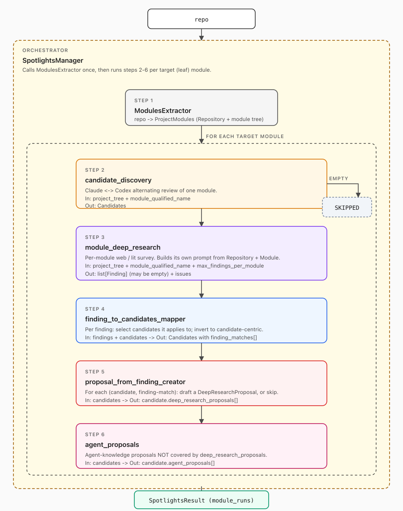

# Spotlights - A deep research agent that locates optimization targets across a repo and proposes evidence-backed changes

Point Spotlights at a repo and an objective ("reduce TTFT", "raise throughput under sustained load") and it returns a ranked,
browsable map of the few places worth touching - each with a concrete,
evidence-backed proposal grounded in the code, the literature, and the
objective.

Most code-research tools either scan broadly and return shallow hits, or dive
deeply into a single file you already picked. Spotlights does the part in
between: it decides *which* symbols across the whole repo are worth deep
investigation for your objective, then spends real research effort on each one.

It works in three tiers, narrowing as it goes:

1. **Structural map** — extract the project's modules and how they fit together.
2. **Candidates** — pick the symbols, per module, most worth investigating for
   the stated objective.
3. **Proposals** — for each candidate, produce literature-derived and
   agent-derived change proposals, with citations and rationale.

The output is a tree of plain Markdown files you browse in any viewer (GitHub,
VS Code preview, Obsidian).

## Architecture




## Install

Prerequisites:

- Python ≥ 3.11
- [`uv`](https://github.com/astral-sh/uv)
- The `claude` CLI on `PATH`, with auth configured via its own login state or
  supported environment variables. Used by the modules extractor, candidate
  discovery, and the Claude executors for steps 4 and 5.
- The `codex` CLI on `PATH`, with auth configured via its own login state or
  supported environment variables. Used by `module_deep_research` (hard-coded
  today) and the Codex executors for steps 2 and 5.
- A target repo on disk (the quickstart below uses [vLLM](https://github.com/vllm-project/vllm)).

Both CLIs are required for the default end-to-end path; the engine will not
run without one of them today. Install, authenticate, and verify each before
launching the engine.

### Install the `claude` CLI

Pick one install method. See the
[official setup docs](https://code.claude.com/docs/en/setup) for the full
matrix (Windows, WSL, Linux package managers, npm, version pinning).

```bash
# macOS / Linux / WSL — native installer (auto-updates)
curl -fsSL https://claude.ai/install.sh | bash

# macOS — Homebrew
brew install --cask claude-code

# Any platform with Node.js 18+ — npm (do NOT use sudo)
npm install -g @anthropic-ai/claude-code
```

Windows PowerShell: `irm https://claude.ai/install.ps1 | iex`.

A Pro, Max, Team, Enterprise, or Console plan is required (the free Claude.ai
plan does not include Claude Code). After install, **open a new terminal** and
authenticate by running `claude` once and following the browser prompt:

```bash
claude          # first run: log in via browser
claude --version
claude doctor   # deeper environment check
```

### Install the `codex` CLI

Pick one install method. See the
[Codex CLI repo](https://github.com/openai/codex) for the full matrix
(Windows, manual binary downloads, API-key auth).

```bash
# macOS / Linux — native installer
curl -fsSL https://chatgpt.com/codex/install.sh | sh

# macOS — Homebrew
brew install --cask codex

# Any platform with Node.js — npm
npm install -g @openai/codex
```

Windows PowerShell:
`powershell -ExecutionPolicy ByPass -c "irm https://chatgpt.com/codex/install.ps1 | iex"`.

A ChatGPT Plus, Pro, Business, Edu, or Enterprise plan is the easiest auth
path; an OpenAI API key also works with extra config. After install, **open a
new terminal** and authenticate by running `codex` once and choosing
"Sign in with ChatGPT":

```bash
codex           # first run: pick "Sign in with ChatGPT"
codex --version
```

### Verify both CLIs from a fresh shell

Open a new terminal (so any `PATH` changes from the installers are picked up)
and confirm both binaries resolve and report a version:

```bash
which claude && claude --version
which codex  && codex  --version
```

If either command is `not found`, re-open your terminal so shell `PATH`
updates from the installers take effect. The native `claude` installer drops
its binary at `~/.local/bin/claude`; the `codex` binary location depends on
the install method (e.g. `/opt/homebrew/bin/codex` for Homebrew, `~/.local/bin/codex` for the native installer) — check the installer's final
output if `codex` still isn't on `PATH`.

### Install the engine

```bash
git clone https://github.com/Video-AI/spotlights-engine.git
cd spotlights-engine
uv sync --all-extras
```

## Quickstart on a vLLM subset

Clone vLLM next to this repo, then:

```bash
spotlights-engine \
  --repo ../vllm \
  --include v1.kv_offload \
  --objective "reduce the median TTFT and median TPOT (Time Per Output Token)" \
  --hint "Multi-turn agentic workload" \
  --output-folder ./spotlights-out \
  --artifacts-dir ./artifacts
```

On disk:

```
spotlights-out/
  index.md                          # repo-level summary, one row per module
  result.json                       # full structured run output
  modules/
    v1.kv_offload.md                # module page: candidates table
    v1.kv_offload/
      <symbol-slug>__<candidate-id>.md   # full per-candidate write-up + proposals
artifacts/
  spotlights_manager/               # checkpoints, raw transcripts (resumable)
```

`--include` accepts one or more dot-form leaf qualified names. Repeat the flag
or pass several values after a single flag:

```bash
spotlights-engine --include v1.kv_offload v1.attention.paged_kv ...
spotlights-engine --include v1.kv_offload --include v1.attention.paged_kv ...
```

## Example output

A sample run on this subset is checked in under
[examples/vllm_subset/](examples/vllm_subset/): browse the rendered
[index.md](examples/vllm_subset/index.md) and per-module pages under
[modules/](examples/vllm_subset/modules/), or inspect the raw
[result.json](examples/vllm_subset/result.json).

## Configuration

All flags are optional once `--repo` and the agent CLIs are available.

| Flag | Default | Purpose |
| --- | --- | --- |
| `--repo` | `../vllm` | Target repo path. |
| `--include` | (all modules) | Restrict to dot-form leaf qualified names. |
| `--objective` | `"reduce hot-path latency on common workloads"` | Threaded into discovery + deep research. |
| `--hint` (repeatable) | `[]` | Workload hints; map to `SpotlightContext.workload_hints`. |
| `--output-folder` | `./spotlights-out` | Where `index.md` and module pages land. |
| `--artifacts-dir` | `./artifacts` | Checkpoints + raw transcripts (resume key). |
| `--max-parallel` | `1` | Modules processed concurrently. |
| `--max-parallel-pairs` | `5` | Within-step parallelism for step 4. |
| `--max-parallel-candidates` | `5` | Within-step parallelism for step 5. |
| `--max-findings-per-module` | `30` | Cap on findings produced by step 3 per module. |


Agent authentication is handled by the underlying `claude` and `codex` CLIs;
no engine config file is required for the happy path.


## License

Apache-2.0 — see [LICENSE](LICENSE).
