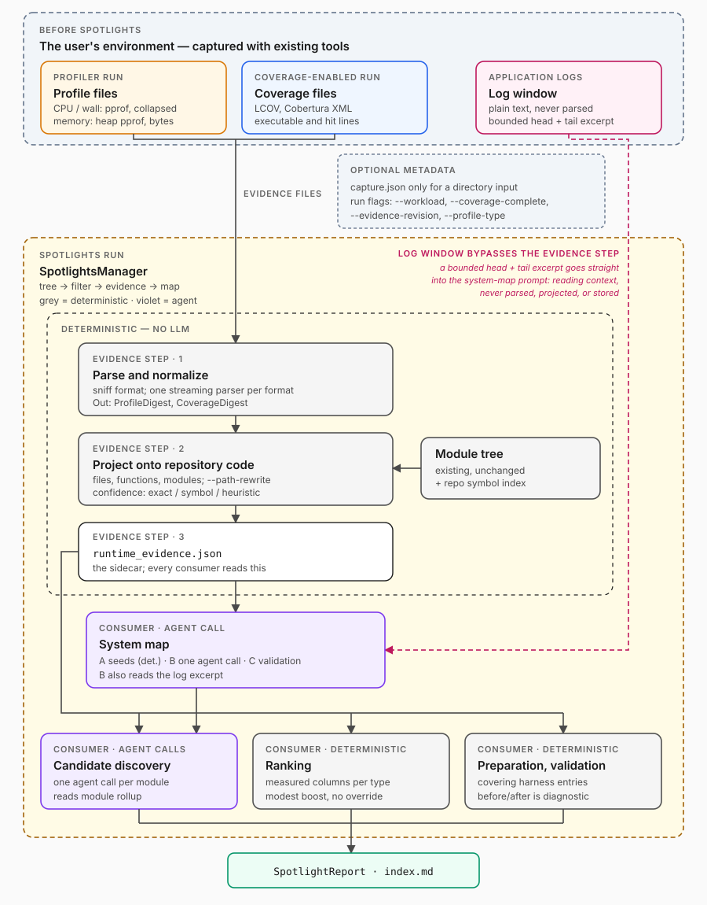
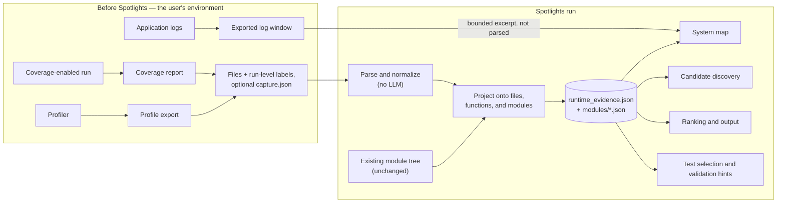

# Runtime Evidence (Profiles, Coverage, and Logs) — High-Level Plan

Spotlights is adding a **system map** to each engine run: an inferred
description of how one *unit of work* — a request, a transaction batch, a
compiled file, whatever the target processes end to end — probably moves
through the source code (§2). This plan adds measurements from a real run so
Spotlights can compare that inferred map with what was actually observed.

## 1. The idea in one minute

Source code shows what a system *can* do. Runtime evidence shows what it did
during a particular test or workload:

| Evidence | Plain-language meaning | Good for | Does **not** prove |
|---|---|---|---|
| **Profile** | A profiler repeatedly records the code that is running, or records the code that allocates memory. The result is an estimate of where CPU time, wall time, or waiting occurred, or of how many bytes and objects each function allocated or still holds. | Finding expensive functions and frequently used call paths. A memory (heap or allocation) profile attributes allocation volume, or live bytes at one instant, to functions and call stacks. | Exact time for every call, unless the source is a deterministic profiler such as Python `cProfile`. A function missing from a sampled profile may simply have been too fast, too rare, or too small an allocator to be sampled. For memory: `alloc_space` counts every allocation, including ones freed at once, so it is not peak memory; only an `inuse_*` snapshot describes live memory, and only at one instant; and a host heap profiler does not see GPU memory. |
| **Coverage** | Coverage instrumentation records which executable lines or branches ran. | Showing which code a test or staging run exercised, and stating that in-scope code did **not** run in that capture. | That executed code is correct, or that unexecuted code is unreachable in other workloads. Code the tracer never saw, such as untraced processes and uninstrumented languages, is absent rather than unexecuted. |
| **Logs** | Services write timestamped events such as startup settings, warnings, and periodic status. Spotlights does not parse them: a bounded log window is handed to the system-map agent as reading context. | Giving the system-map agent lifecycle clues: startup settings, enabled features, and the coarse order of events. | Anything about a module. Logs are not parsed, projected onto modules, or stored as evidence, and they are not a complete or globally ordered trace: concurrent services can interleave events, clocks can differ, and code that does not log remains invisible. |

These terms recur throughout this plan:

- **Capture**: one exported profile or coverage report, together with labels
  describing how it was produced. By default the labels are read from the
  file or from the run's flags (§5.2).
- **Log window**: a text log supplied with `--logs-from`. It is reading
  context for the system-map agent, not a capture: it is neither parsed nor
  projected.
- **Workload**: the activity that produced a capture, such as “multi-turn
  requests at 20 requests/second” or “the unit-test suite.” One run of
  Spotlights describes one workload (`--workload`).
- **Unit of work**: the map's term for whatever the target processes end to
  end — one inference request, one transaction batch, one compiled file — and
  what its `per_unit` / `per_element` rate labels are read relative to (§2).
  It is not a workload: a workload is the activity that produced a capture,
  and one workload exercises many units of work.
- **Projection**: matching a measurement such as
  `/app/vllm/core/scheduler.py:120` to a file, function, and module in the
  checked-out repository.
- **Digest**: a compact, normalized summary produced from a raw capture.
- **Sidecar**: a generated companion file stored with the other run artifacts,
  rather than inside the reusable module tree.
- **Harness entry**: one named test command known to Spotlights, such as the
  command that runs all cache unit tests. It may run many individual tests.

The key safety rule is: **not observed is not the same as dead code**. The
two measured sources make different kinds of absence claim, and the plan keeps
them apart:

- **Coverage** can state a real negative. A file inside the capture's
  measured scope that shows zero hits did not execute in that capture. The
  claim is only as good as the capture's instrumentation scope, defaulted or
  declared (§5.2):
  untraced processes, uninstrumented languages such as C++ and CUDA, and code
  that runs inside compiled kernels or graphs all look unexecuted.
- **Profiles** can only say `not_sampled`. A function that is fast or rare, or
  that allocates little, is routinely absent from a sampled profile.
- **Logs** make no absence claim. They are not parsed or projected, so a
  module that never appears in the log window is simply unmentioned, and no
  log-derived state exists for it.

Even a valid coverage negative is a fact about one capture of one workload on
one revision. It does not make the code unreachable: another run of the same
workload can take a different path, another configuration or node role can
use the module, and an unexecuted path is often the optimization itself, such
as a fast path that never engages because a heuristic falls back to a slow
one. Spotlights may therefore annotate and lower the priority of code that
was not observed, and a coverage negative may feed the opt-in triage in §10.4,
but no source may label code unreachable or exclude it automatically.

For example, suppose a two-minute CPU profile attributes 13% of its measured
CPU value directly to the cache-offload module, an allocation profile of the
same two minutes attributes 26% of all allocated bytes to it, a unit-test
coverage report hits 94% of one candidate file's executable lines, and
the supplied log window lets the system-map agent read that prefix caching
was enabled at startup. Spotlights can say that the module was active in that
workload, that it was a large allocator there, and identify a useful
regression-test command. It still cannot say that the test proves
correctness, that 13% equals 13% of request latency, that 26% of allocated
bytes means 26% of peak memory or a leak, or that an unobserved module is
unused in every deployment.

## 2. The system map, and why runtime evidence feeds it

**The problem the map solves.** Each per-module discovery agent reasons
about one module in isolation, and that containment is enforced rather than
merely requested: the "Repository context" block of its prompt, meant to
describe the surrounding system, is empty in every run today. The map plan
names three costs of the isolation — a candidate whose optimization unit spans
two modules has no name for the seam it belongs to; a candidate that lives in
one module but is governed by another gets its impact guessed; and every
module grades `high` on its own private scale, which the ranker inherits.

The third is the one visible in saved runs: the ranker sees only short
candidate cards and never the code or the execution path, and in three saved
runs its top-20 was the `high` label re-sorted. A candidate in a module the
workload touches on every unit of work thus looks no more important than one
in code that runs once at startup, and seams that experts found end up
buried; in the saved llm-d run, two expert seams on the prefix-cache stage,
where a multi-turn workload's time-to-first-token is decided, landed at ranks
54 and 66.

Runtime evidence bears most directly on the second cost. Impact "governed by
another module" is exactly what a measurement settles: how often the caller
actually ran, whether the branch was taken in this deployment, what share of
CPU or of allocated bytes the module really owns. The map supplies the stage
that names the seam; the capture supplies the rate.

**What the map is.** The map is the shared ruler: a one-page, per-run
description of how one unit of work moves through the repository at runtime.
The target is any repository the engine is pointed at, not a class of system,
so the map's own vocabularies stay rate- and role-based and every domain term
in a map comes from the target itself. The module tree says what lives where
and who imports whom; the map says what runs, in what order, how often, and
which of it the objective cares about:

1. **Entry points**: where work enters and where the process starts, each
   anchored to a file and a symbol and given a `kind` from a closed
   vocabulary: `service`, `job`, `cli`, `library`, `startup`, or
   `background`.
2. **Execution lifecycle**: one line naming what a unit of work *is* for this
   repository ("one inference request", "one transaction batch"), which fixes
   the meaning of every rate label below, followed by the ordered stages such
   a unit passes through. Each stage is anchored to the function where it
   begins, lists its modules, is optionally conditioned ("only on a
   prefix-cache miss"), and carries a **frequency** from a closed rate
   ladder: `startup`, `per_unit`, `per_step`, `per_element`, `conditional`,
   `background`, or `off_path`. The ladder is ordered — `off_path` <
   `background` < `startup` < `conditional` < `per_unit` < `per_step` <
   `per_element` — wherever a dominant or highest rate is needed, and a
   target with no inner loop simply never uses `per_step` or `per_element`.
3. **Objective → stages**: a weight in `[0, 1]` per stage for how much the
   objective depends on it, with a rationale; the only objective-dependent
   section.
4. **Module × stage table** (`module_rows`): one row per module with its
   stages, dominant frequency, `on_path` (`yes`, `conditional`, or `no`), a
   derived `path_weight`, and a one-line note. Off-path modules are listed,
   not omitted.
5. **Hot paths**: optional, and empty unless evidence fills it: a profile
   (§10.4) or, later, a repository-history prior.

The map also carries an `advisory` flag, set by a deterministic guard when the
map comes out degenerate — two stages or fewer, or fewer than a quarter of the
selected modules on the path. An advisory map is still rendered and still
handed to discovery as context, but it drives no triage and no path weighting.
That flag bounds what evidence may do here too: the evidence triage in §10.4
is gated on it.

Abridged example for a vLLM run:

```markdown
unit of work: one inference request
objective: reduce median TTFT and median TPOT · hint: multi-turn agentic workload

## Entry points
- service: vllm/entrypoints/openai/api_server.py → AsyncLLM.generate
- library: vllm/entrypoints/llm.py → LLMEngine.step
- startup: model_loader, compilation, warmup — once, off the execution path

## Execution lifecycle
1. tokenize/preprocess  inputs, multimodal                        per_unit
2. admission/schedule   v1/engine/core, v1/core/sched             per_step
3. prefix-cache lookup  v1/core/kv_cache_manager, v1/kv_offload   per_unit (offload tier: on miss)
4. prefill              v1/worker, v1/attention                   per_unit, chunked
5. decode               v1/worker, v1/attention, v1/sample        per_element (token)
6. detokenize/stream    v1/engine/output_processor                per_element (token)
7. free/evict           v1/core/kv_cache_manager, v1/kv_offload   per_unit

## Module × stage
| module        | stages | frequency   | on path     | weight |
| v1/kv_offload | 3,7    | per_unit    | yes         | 1.0    |
| v1/worker     | 4,5    | per_element | yes         | 1.0    |
| multimodal    | 1      | per_unit    | conditional | 0.2    |
| lora          | —      | off_path    | no          | 0.0    |
```

The shape reads the same way on a target that serves nothing: for an ordering
service the unit of work is a transaction batch, a consensus round is
`per_step`, signature verification is `per_element`, and gossip is
`background`. Evidence is projected onto whichever rungs the target actually
has — nothing in §6 or §7 assumes a request.

**How it is built, and who reads it.** The map is a run-level step of its
own, built once per run after the module tree is extracted and filtered and
before the per-module agents fan out (§4). Discovery then reads it as the
"Repository context" of every per-module prompt and grades impact against
it; ranking copies `stage`, `frequency`, `on_path`, and `path_weight` onto
each candidate card and into its pre-score; and the rendered output shows it
in `index.md` beside its validation issues. It is built in three stages:

- **Stage A, deterministic seeds**: likely entry points found by cheap
  greps, plus the module list as the agent's reading guide; hints the agent
  may reject.
- **Stage B, one read-only agent call**: say what one unit of work is for
  this repository, trace from each entry point to the point where such a unit
  is complete, name the stage boundaries as functions, give each stage a
  frequency and its modules, then weight the stages against the objective and
  workload hints.
- **Stage C, deterministic validation and derivation**: check every anchor
  against the checkout, drop unknown module names with an issue, give a
  module the agent never placed an explicit off-path row flagged "not placed
  by the agent", apply the degenerate-map guard that sets `advisory`, and
  compute `module_rows`, which the agent never writes.

The result is stored as two halves with separate fingerprints: a
`LifecycleMap` (unit of work, entry points, stages) that depends only on the
checkout, and an `ObjectiveOverlay` (objective, hints, stage weights) that
depends on the run context. `module_rows` is a pure function of the two,
recomputed rather than stored as agent output. That split decides where this
plan's inputs belong: evidence and the log excerpt feed the trace, so they
fingerprint with the lifecycle half (§9.3). The step also has modes — `auto`,
`off`, `required`, or a user-supplied map `FILE` — and in `FILE` mode Stages A
and B do not run at all, so the hints of §10.1 and §10.2 have nowhere to go
while the deterministic cross-checks and measured columns of §10.3 and §10.4
still apply.

**Why runtime evidence matters to it.** Everything in the map is inferred
from code: the agent reads the source and concludes that decode runs once per
output element and that LoRA management is off the path. Reading can be wrong,
and nothing in the map can show that by itself. Profiles and coverage let
Spotlights check the inference against a real workload: a `per_element` stage
with no samples in a capture that did process units of work is suspicious, and
so is an `off_path` module with 13% of CPU (§10.3). Those two checks are also
the cheapest outside signal that a map is wrong wholesale — a map that puts
most of the repository off the path while the capture shows measured work
spread across it is precisely the case the `advisory` guard exists for. They
also fill the hot-paths section with measured functions and put measured
columns beside the inferred `frequency` and `on_path` values (§10.4). The log
window plays a different role: the agent reads it while tracing and picks up
lifecycle clues such as startup settings, enabled features, and the coarse
order of events (§10.2).
Evidence constrains the inference; it does not replace it. The agent still
names the stages by reading code, a disagreement becomes a recorded issue
rather than a silent correction, and without evidence the map is built
exactly as before.

## 3. Goal and scope

Add an optional **runtime-evidence layer** to each engine run. The evidence is
captured by the user's existing tools, before or independently of Spotlights.
Spotlights parses the exported profiles and coverage reports, maps them to the
module tree, stores a compact summary, and gives that summary to the system
map, discovery, ranking, rendering, and validation steps. A supplied log
window is not parsed: it is handed to the system-map agent as reading context
and goes nowhere else (§6.4).

**Four things share the name.** The **layer** is the concept: measurements
from a real workload, weighed in §1 and fed to the map in §2. The **step** is
the deterministic run step that parses, projects, and persists them, placed
between module filtering and the system map (§4) and living in a
`runtime_evidence/` package that also holds the symbol index (§7.1). The
**artifact** is the evidence sidecar under `--artifacts-dir`: one run-level
`runtime_evidence.json` beside one shard per module, together the only thing
every downstream consumer reads (§9.2).
The **public field** is `SpotlightReport.runtime_evidence`, the subset of that
artifact copied into the rendered report (§11.1). Unqualified, "runtime
evidence" in the rest of this plan means the layer, and "the sidecar" always
means the artifact.

This matters because the engine currently reasons primarily from code. It can
rank a plausible optimization highly even when the supplied workload never
uses that path. Runtime evidence adds workload-specific context while keeping
the source-based analysis available when measurements are missing.

The initial interface is three optional, repeatable CLI inputs that take
plain files:

```text
--profile-from FILE      a profile export (repeatable)
--coverage-from FILE     a coverage report (repeatable)
--logs-from FILE         a text log window (repeatable)
```

No manifest is required. Format, capture ID, measurement types, duration,
sampling period, and container path prefixes are read from the file or
inferred (§5.2). A few optional run-level flags supply what a file cannot
say:

```text
--workload NAME          label for the workload behind every capture in this run (default: default)
--evidence-revision SHA  revision the captures were taken on (default: the checkout, recorded as assumed)
--coverage-complete      assert that every process of the workload ran under the coverage tracer
--profile-format NAME    override format sniffing for the run's profile files (also --coverage-format)
--path-rewrite FROM=TO   explicit path rewrite, applied before suffix-matched inference (repeatable)
```

One flag is per file rather than per run, because measurement type is a
property of a single capture:

```text
--profile-type TYPE      measurement type of the preceding --profile-from (repeatable)
```

`--profile-type` attaches to the most recent `--profile-from` on the command
line: it names the type to read from a multi-type profile, or the type a
collapsed-stack file's weights are in. So one run can type two collapsed
files differently —
`--profile-from cpu.collapsed --profile-type cpu --profile-from alloc.collapsed --profile-type alloc_space`
— without any manifest. A `--profile-type` with no preceding `--profile-from`
is an error, and a second one for the same file replaces the first. pprof
files declare their own sample types and need none (§5.2).

A profile or coverage `FILE` may instead be a directory; a directory must
hold a `capture.json` manifest listing its files (§5.2). A later phase adds
HTTPS backend URLs.

`--logs-from` is different in kind from the other two inputs. Spotlights does
not parse the log window. It becomes a bounded text excerpt, with a size cap
and head-plus-tail sampling when the file is over the cap, that is passed to
the system-map prompt as reading context (§6.4). The normal production stream
(`INFO`, `WARN`, and `ERROR`) is the intended input. Debug/trace logs are
still discouraged: they are much larger, so the cap drops more of them, and
they are more likely to contain sensitive values.

In scope:

- capture metadata read from the files and a few run-level flags by default,
  with an optional `capture.json` manifest for what inference cannot supply
  (§5.2);
- deterministic parsers for supported profile and coverage formats;
- a deterministic `runtime_evidence/` run-level step that normalizes,
  projects, persists, and renders the evidence;
- explicit quality, scope, and unresolved-mapping information;
- optional use by the system map and downstream consumers;
- a bounded log excerpt, built without parsing, for the system-map prompt.

Out of scope:

- installing instrumentation or starting/stopping profilers;
- enabling code coverage in production;
- retaining raw logs in Spotlights output (the persisted system-map prompt is
  the one place the bounded excerpt lives; §5.3);
- constructing a complete call graph or distributed trace;
- changing the modules extractor or the project-tree schema.

For a URL source, Spotlights may later request an already available export.
Some profiler endpoints create a short profile when queried; that behavior
must be explicit and opt-in because it is more than merely downloading a
file.

## 4. End-to-end flow



The figure reads top to bottom. The dashed band at the top is the user's own
environment: a profiler run, a coverage-enabled run, and an application log,
each producing plain files before Spotlights is involved. Grey boxes inside
the run are deterministic code; violet boxes are agent calls. The evidence
step parses, projects, and persists; every consumer then reads the sidecar and
never a raw capture.
The pink lane on the right is the log window, which skips the evidence step
entirely and reaches only the system-map prompt.

The same flow as text:



The new manager order is:

```text
extract module tree
→ apply module filter
→ build runtime evidence (new; deterministic)
→ build system map
→ run per-module discovery
```

The system map is the first consumer of the evidence step, so that step runs
immediately before it. The log window bypasses the evidence step entirely:
the system-map step builds the bounded excerpt itself and inserts it into its
own prompt (§6.4). If no evidence or log window is supplied, or optional
evidence cannot be parsed, the rest of the run behaves as it does today.

## 5. Capture contract

**Minimal invocation.** Plain files are enough. The simplest run with
evidence adds the evidence flags to the usual command:

```bash
spotlights-engine \
  --repo ../vllm \
  --objective "reduce the median TTFT and median TPOT" \
  --output-folder ./spotlights-out \
  --artifacts-dir ./artifacts \
  --profile-from cpu.pprof \
  --profile-from heap.pprof \
  --coverage-from unit-kv-cache.lcov \
  --logs-from server.log \
  --workload agentic-multiturn \
  --coverage-complete
```

From this, Spotlights infers:

- `cpu.pprof` and `heap.pprof` are profiles (from the flag) in pprof format
  (from the file signature), with capture IDs `cpu` and `heap`. Sample types,
  units, duration, and sampling period are read from the files, and
  `heap.pprof` splits into `heap:alloc_space`, `heap:alloc_objects`,
  `heap:inuse_space`, and `heap:inuse_objects` (§5.2).
- `unit-kv-cache.lcov` is coverage (from the flag) in LCOV format (from its
  `SF:`/`DA:` records), with capture ID and harness entry `unit-kv-cache`
  (§6.3). `--coverage-complete` asserts that every process ran under the
  tracer, and vLLM's per-project defaults supply the instrumented languages,
  `source_roots`, and `untraced_paths`.
- Every capture belongs to the workload `agentic-multiturn`.
- The captures are taken to come from the checked-out revision, recorded as
  `assumed`; line-level data is admitted file by file where the
  function-anchor check passes (§7.3).
- Container path prefixes such as `/app/` are inferred by matching path
  suffixes against the checkout (§7.1).
- `server.log` becomes a bounded excerpt for the system-map prompt (§6.4);
  it needs no metadata.

Anything none of that can express — several workloads or revisions in one
run, or per-capture harness entries, instrumentation scope, or format — needs
the optional `capture.json` manifest (§5.2).

### 5.1 Supported formats

Spotlights supports file **formats**, not profiler or coverage-tool vendors.
For example, any product that exports pprof can use the same pprof parser.

| Input | Launch support | Later support | Convert before import |
|---|---|---|---|
| Profile | Time: collapsed stacks; pprof. Memory: pprof heap profiles (sample types `alloc_space`, `alloc_objects`, `inuse_space`, `inuse_objects`, as written by Go's `runtime/pprof` and by any tool that exports pprof); collapsed stacks whose weight is bytes or allocation counts, such as async-profiler's allocation mode with collapsed output or Austin's memory mode for Python. | Time: speedscope JSON; V8 `.cpuprofile`; Chrome/PyTorch trace JSON; Python `cProfile` stats. Memory: V8 sampling heap profiles (`.heapprofile` JSON from Node's `--heap-prof`); Python `memray` exports, Python `tracemalloc` snapshots, and PyTorch CUDA memory snapshots (`torch.cuda.memory._dump_snapshot`) through small converters to byte-weighted collapsed stacks, run before import, with the CUDA snapshot landing in the separate GPU memory family (§5.2). | JFR, `perf.data`, and .NET nettrace should be converted with their standard vendor/community tools; JFR allocation events convert with async-profiler's converter or the JDK `jfr` tool. GPU-kernel summaries need a separate, explicitly defined format. |
| Coverage | LCOV; Cobertura XML | JaCoCo XML; Go cover profile | Clover XML can be converted to Cobertura or added later. |
| Logs | No format requirement: any text log. A bounded excerpt goes to the system-map prompt (§6.4); there is no parser. | — | — |

Beginner notes:

- **Collapsed stacks** are text lines containing a call chain and a count;
  flame-graph tools commonly use this representation.
- **pprof** is a protobuf-based profile format used by Go and many continuous
  profilers. One file can contain several measurement types and units.
- A **heap profile** or **allocation profile** attributes allocated bytes,
  allocation counts, or live bytes to the code that allocated them (§5.2).
  Go's `runtime/pprof` writes one as pprof with all four memory sample types;
  async-profiler's allocation mode and Austin's memory mode can write
  collapsed stacks whose weight is memory rather than time samples, so the
  unit must be declared with that file's own `--profile-type` (§3) or a
  manifest (§5.2).
- **LCOV**, **Cobertura**, and **JaCoCo** are coverage-report formats.
  They describe executable and hit lines, not which tests passed or failed.

Format is sniffed from file content (§5.2); explicit CLI or manifest values
override sniffing, and a file whose content contradicts an explicit format is
rejected rather than guessed (§12). An unrecognized profile or coverage format
produces a clear issue naming the supported formats; the normal path never
sends raw evidence to an LLM as a fallback. The log excerpt is not a fallback
but the design: it is reading context, not evidence (§6.4).

### 5.2 Capture metadata: inferred by default, manifest optional

Measurements are meaningful only when their origin is known, but the origin
rarely needs to be typed in. A profile or coverage file passed on the command
line carries no manifest: everything Spotlights needs is read from the file,
defaulted, or given by one of the run-level flags in §3, and an optional
`capture.json` covers only what none of those can say. A log window has no
metadata at all (§6.4).

| Field | Default or inference | Override |
|---|---|---|
| `kind` | The flag the file was given to: `--profile-from` or `--coverage-from`. | A manifest entry may repeat it; it must agree with the flag. |
| `format` | Sniffed from content: the gzip or protobuf signature for pprof; `SF:`/`DA:` records for LCOV; a `<coverage>` root element with `line-rate` for Cobertura; `frame;frame;frame <number>` lines for collapsed stacks. A file that matches nothing is rejected with the supported-format list (§5.1). Spotlights never picks between two plausible formats: ambiguity is an error that names the override. | `--profile-format NAME` or `--coverage-format NAME`, applied to every file given to that flag; manifest `format` per capture. |
| `capture_id` | The file stem (`cpu.pprof` → `cpu`), made unique with a numeric suffix when two files share a stem (`cpu`, `cpu-2`) and reported. | Manifest `capture_id`. |
| `workload_id` | One label per run: `--workload NAME`, default `default`. Comparing workloads means running Spotlights twice (§9.3). | Manifest `workload_id` per capture, the one way to hold several workloads in one run. |
| measurement type and unit | Read from the file. A pprof file declares its sample types and units, and a file with several types is split into one logical capture per type (below), so nothing needs selecting. A collapsed-stack file declares neither and is read as time-family sample counts (`samples`, unit `count`). | `--profile-type TYPE`, attached to the `--profile-from` it follows (§3), reads only that type from a multi-type file and names the type of a collapsed-stack file whose weights are bytes or allocation counts; manifest `sample_type` and `sample_unit` do the same per capture. |
| `duration_s`, sample count, sampling period | Read from the file when present: pprof carries a duration and a `period_type`/`period` pair; collapsed stacks carry neither, so their duration is unknown and only counts are stored. | Manifest `duration_s` and `captured_at`. |
| `revision` | The checkout revision, recorded as revision quality `assumed`, never `exact`. Line-level data is then admitted per file by the function-anchor check in §7.3. | `--evidence-revision SHA` asserts the real revision and enables the exact/mismatch policy of §7.3; manifest `revision` per capture. |
| `path_rewrites` | Suffix matching against the checked-out file list: for each measured path, the longest suffix that identifies exactly one repository file; the prefix stripped to reach it (for example `/app/`) becomes an inferred rewrite, reported once per capture in the projection statistics (§7.1, §9.2). | `--path-rewrite FROM=TO` (repeatable) or manifest `path_rewrites`. |
| coverage instrumentation scope | `processes: unknown`: hit lines are positive evidence and zero hits mean nothing (§6.3). `languages` comes from per-project defaults for known targets, otherwise from the file extensions in the report; `source_roots` and `untraced_paths` come from per-project defaults for known targets such as vLLM (§15). | `--coverage-complete` asserts `processes: all` for the run's coverage files; a manifest `instrumentation` block sets any field per capture. |
| `harness_entry` | The coverage file's stem, so a file named after its test command (`unit-kv-cache.lcov`) labels itself (§6.3). | Manifest `harness_entry`. |
| `service` | Not set; it is a label only. | Manifest `service`. |

Beginner notes:

- **Sniffing** means recognizing a format from the first bytes or lines of a
  file, the way the Unix `file` command does, instead of trusting the file
  extension.
- A **function anchor** is a function name paired with the line it starts on.
  Profiles and most coverage formats record them, and §7.3 compares them with
  the checkout to decide whether line numbers can be trusted.

A manifest is needed only when one run holds captures from several workloads
or revisions, or when captures need their own harness entries,
instrumentation scope, or format. It is a
directory-level `capture.json` that lists the directory's files; a directory
is given to one flag and holds captures of that kind. Each entry carries
`source_file` plus only what inference cannot supply:

```json
{
  "schema_version": 1,
  "captures": [
    {"source_file": "unit-kv-cache.lcov"},
    {
      "source_file": "serve.lcov",
      "workload_id": "e2e-serve",
      "harness_entry": "e2e-serve-smoke",
      "revision": {"git_sha": "0ca9a65"},
      "instrumentation": {
        "processes": "partial",
        "traced_paths": ["vllm/entrypoints/**"]
      }
    }
  ]
}
```

The first entry inherits everything from the run: its workload from
`--workload`, its harness entry from its stem, its scope from
`--coverage-complete` or the defaults. The second states a different workload
and harness entry, the revision it was really taken on, and a partial tracer
scope, because none of those can be read from an LCOV file. A profile
directory uses the same shape; a collapsed-stack file whose weights are bytes
adds `sample_type` and `sample_unit`.

Precedence is specific over general: a manifest entry overrides run-level
flags, and both override sniffing and defaults. Spotlights never blends a
guess with an explicit value: an explicit format that disagrees with the
file's content rejects that capture (§12). A directory input always needs a
`capture.json`; Spotlights does not guess among an arbitrary directory of
files. A single file passed on the command line never needs one; to give one
file its own metadata, put it in a directory with a `capture.json`.

**Measurement types.** Profile measurement types fall into named families.
The **time family** covers CPU, wall time, lock wait, and off-CPU time,
measured in time units or as sample counts. The **memory family** covers heap
and allocation profiles and uses, for every source, the sample-type names of
Go's `runtime/pprof` heap profiles:

| Sample type | Unit | Meaning |
|---|---|---|
| `alloc_space` | bytes | Bytes allocated during the capture, whether or not they were freed since. |
| `alloc_objects` | count | Number of allocations during the capture. |
| `inuse_space` | bytes | Bytes still live at the snapshot instant. |
| `inuse_objects` | count | Objects still live at the snapshot instant. |

A byte-weighted collapsed file from async-profiler's allocation mode is
therefore recorded as `alloc_space` too. GPU variants (`gpu_alloc_space`,
`gpu_inuse_space`, and their object counts; names provisional), such as
device bytes from a PyTorch CUDA memory snapshot, are a separate family and
later work (§13): a host heap profiler does not see GPU memory, and the two
families are never summed. Type and unit are always recorded; a sample count
must never be presented as seconds unless the source provides a valid
sampling period or duration conversion, and bytes are never converted into
time or time into bytes (§6.2).

One logical capture has exactly one measurement type. A pprof file that
contains several types, as every Go heap profile does with the four memory
types above, is split into one logical capture per type, each with its own
fractions and its own denominator (§6.2). A split capture takes the file's
`capture_id` with the type appended, for example `heap:alloc_space`, so the
uniqueness rule in §5.3 still holds; `--profile-type` or a manifest
`sample_type` reads only that type and keeps the ID unchanged.

**Instrumentation scope.** A coverage report cannot describe what the tracer
never saw, so every coverage capture carries a scope, defaulted as in the
table above or declared in a manifest `instrumentation` block:

- `languages`: the languages the tool instruments. Files in any other
  language are `unknown` whatever the report says.
- `source_roots`: the configured source roots. With a root configured,
  coverage.py reports never-imported files under it at zero hits; without
  one, such files are simply missing from the report.
- `processes`: `all` when every process of the workload ran under the tracer
  or the workload is single-process; `partial` when only some did; `unknown`
  when nobody can say. vLLM is the motivating case: its V1 engine runs the
  scheduler and KV-cache manager in a child process and the model runner in
  worker processes, so a parent-only capture reports the scheduler at zero
  hits while it is the hottest code in the workload. `--coverage-complete`
  is the user's assertion that this did not happen.
- `traced_paths`: for a `partial` capture, the path patterns whose zero hits
  are still meaningful.
- `untraced_paths`: path patterns whose code executes outside the tracer even
  when it is imported under it, such as Triton kernels and `torch.compile`
  regions. Zero hits there are `unknown`.

Without `--coverage-complete` or a manifest block, §6.3 treats `processes` as
`unknown`: hit lines remain valid positive evidence, and zero hits carry no
negative meaning.

### 5.3 Capture and privacy rules

- `capture_id` values are unique within a run: an inferred ID takes a numeric
  suffix when two files share a stem (§5.2), and a manifest must not reuse
  one. Every derived number keeps its capture ID so results from different
  workloads are not silently mixed.
- The capture's revision is compared with the checkout revision. A revision
  stated with `--evidence-revision` or a manifest and equal to the checkout is
  `exact` and allows file-and-line projection; with nothing stated the
  checkout is `assumed`, and line-level data is admitted per file by the
  function-anchor check. See §7.3 for both and for safe mismatch behavior.
- Paths are normalized to repository-relative paths. Rewrites that escape the
  repository, including `..` traversal or resolved symlinks outside the
  repository, are rejected.
- The evidence sidecar belongs under `--artifacts-dir`, which remains outside
  the scanned repository. Raw captures should also be kept outside the target
  repository or explicitly excluded from scanning and version control.
- Logs are untrusted and may contain credentials, request data, or personal
  information. Because there is no parser, Spotlights cannot redact them. The
  user must supply a log window that is safe to send to the model.
- Spotlights records only the log file's hash, size, and time window (when
  derivable from the first and last timestamps) in the run artifacts. It never
  copies raw lines into the evidence sidecar, `result.json`, or rendered
  reports. The excerpt reaches only the system-map prompt, which is persisted
  under the run's `system_map/` directory like other steps' prompts; that
  directory therefore holds the excerpt and must be treated with the same care
  as the raw log.
- URL credentials come from environment variables or the platform credential
  provider. They are never accepted in persisted URLs, manifests, prompts, or
  output. URL fetching is limited to HTTPS by default, with time, size, and
  redirect limits.

## 6. Parsing and normalization

### 6.1 Common principles

- One streaming parser per format, implemented as ordinary code and tested on
  small checked-in fixtures.
- Parsing and projection are deterministic, and so are format sniffing,
  suffix-matched path inference, and the anchor check (§5.2, §7.3): the same
  repository, run-level flags, manifest if any, parser version, and source
  bytes produce the same sidecar.
- Large files have configurable byte, record, and decompression limits.
- Unsupported records are counted and reported rather than silently ignored.
- Vendor converters are invoked by the user before import in the first
  release. Spotlights does not parse unstable binary formats itself.
- The existing signal pipeline's raw OpenTelemetry directory branch may still
  use an agent. This new runtime-evidence path does not: it accepts only a
  recognized format and leaves unknown facts as unknown. The log window is
  outside this path (§6.4).

### 6.2 Profiles

Each supported parser emits records with:

- function and, when available, source file and line;
- measurement type and unit;
- **self value**: samples or measured value attributed to the function itself;
- **inclusive value**: value attributed to the function and its callees;
- capture ID and workload ID.

The sidecar also records `self_fraction` and `inclusive_fraction`, whose
denominator is the total value in that same logical capture, which has exactly
one measurement type (§5.2). Self fractions can be added across disjoint
functions. Inclusive fractions usually overlap and must **not** be added to
produce a total.

For sampled profiles, values are estimates. The parser records total samples,
sampling period when known, and a quality warning for very small captures.
For deterministic profiles such as `cProfile`, the parser records call counts
and measured time instead of pretending they are samples.

Collapsed-stack parsers must normalize and record stack direction before
choosing “root” and “leaf” frames. A collapsed-stack file carries no type or
unit of its own, so it is read as time-family sample counts unless that
file's `--profile-type` (§3) or a manifest says otherwise; a byte- or
count-weighted file must be declared, or it is mistaken for time samples.
pprof parsers must read the file's declared sample types and units rather
than assuming every profile contains CPU time, and must emit one logical
capture per type read (§5.2).

Memory profiles use the same record shape, with these additional rules:

- **Self and inclusive apply equally.** A function's self value is the bytes
  or objects attributed to its own frame as the allocating (or, for
  `inuse_*`, the still-holding) leaf; its inclusive value adds what its
  callees allocated or hold. Fractions follow the denominator rule above, per
  logical capture and type.
- **`inuse_*` profiles are snapshots.** `inuse_space` and `inuse_objects`
  describe live memory at one instant, so such a logical capture carries
  `snapshot: true` in the sidecar and no `duration_s`; `captured_at`, read
  from the file's timestamp when it has one (pprof `time_nanos`) or from a
  manifest, is the instant it describes. A Go heap profile, for example,
  reflects the heap as of the most recently completed garbage collection,
  not the moment of export. Two snapshots of the same workload at different
  times are two captures (§9.3), never averaged.
- **Allocation profiles are usually sampled by bytes, not by time.** Go's
  `runtime.MemProfileRate` (512 KiB by default) and async-profiler's
  allocation interval each yield roughly one sample per that many allocated
  bytes. The parser records the sampling unit and interval when the source
  declares them, as a pprof `period_type`/`period` pair does, and applies
  the same small-capture quality warning to a small number of allocation
  samples. Whether `alloc_*` values cover a window or the whole process
  lifetime also depends on the source: async-profiler's allocation mode
  covers the profiling window, while a Go heap profile's `alloc_*` values
  are cumulative since the program started unless an earlier profile is
  subtracted (`go tool pprof -base`). `duration_s` must state the window the
  values actually cover: it is read from the file when the file declares one,
  may be set by a manifest, and is left unset for a cumulative capture.
- **Never convert bytes into time or time into bytes.** A memory value has
  no duration equivalent and a CPU value has no byte equivalent; every value
  stays in its declared unit, and no derived "hotness" combines the two
  (§10.4).
- **Read each type for what it means.** A large `alloc_space` share is an
  allocation-rate signal: those bytes may have been freed immediately, so it
  says nothing about peak or resident memory and nothing about leaks. Growth
  of `inuse_space` across successive snapshots of the same workload is a
  retention signal, which may point at a leak or an unbounded cache; a
  single snapshot cannot show growth.

### 6.3 Coverage

Coverage normalization records, per file:

- executable and hit lines;
- branches, when the source format provides them;
- function hit counts, when the source format provides them;
- capture ID, workload ID, and optional harness-entry ID.

`line_rate` means `hit executable lines / all executable lines`. Each file
takes one of three observation states, and the negative one is gated by the
capture's instrumentation scope, defaulted or declared (§5.2):

- `hit`: at least one executable line ran. Hit lines are valid positive
  evidence from any capture, subject only to the revision policy in §7.3.
- `not_hit_in_capture`: the file is in the report with zero hit lines, and
  the negative is meaningful: `processes` is `all`, or it is `partial` and
  the path matches `traced_paths`; the file's language is instrumented; and
  the path does not match `untraced_paths`. This state means "did not execute
  in this capture," never "dead."
- `unknown`: the file is missing from the report, or it has zero hits but one
  of the conditions above fails. The capture records one issue naming the
  failed condition, not one issue per file.

A capture with neither `--coverage-complete` nor a manifest instrumentation
block yields only `hit` and `unknown`.

An important limitation: one coverage file for a whole test command
identifies coverage for that **command**, not for each named test. The
capture's `harness_entry`, by default the coverage file's stem and otherwise
a manifest value, labels the capture with the test command that produced it
(§5.2), so the first implementation builds a
**span-to-harness-entry index**, for example “this line was exercised by the
`unit-kv-cache` test command.” Exact `span-to-test` mapping requires one
capture per individual test or a tool feature such as Coverage.py dynamic
contexts. That is later work.

Pass/fail status is not an input. A covering harness entry is a regression
check that the validation step can run later (§11.3), not a recorded outcome,
and running it is not proof that a future change is correct.

### 6.4 Logs are not parsed

Spotlights has no log parser, template miner, or configuration extractor. A
file supplied with `--logs-from` is read as plain text and reduced to a
bounded excerpt: a configurable size cap applies, and when the file is over
the cap the excerpt keeps the head and the tail, so startup settings and the
most recent events both survive, with a marker and a dropped-line count where
the middle was cut. Lines are passed through unchanged; container-runtime
prefixes, timestamps, and levels are left as they are.

The excerpt goes to exactly one place: the system-map prompt, where it is
reading context for lifecycle inference (§10.2). It is never projected onto
files or modules, never enters the sidecar — neither the run-level
`runtime_evidence.json` nor any module shard — and never reaches per-module
discovery, ranking, rendering, or validation. Outside the
system-map step, Spotlights records only the file's hash, size, and, when the
first and last lines carry recognizable timestamps, the time window (§5.3).

## 7. Projection onto repository code

### 7.1 How matching works

Projection uses, in decreasing order of confidence:

1. normalized repository-relative file plus valid line number;
2. normalized file plus qualified function name;
3. qualified function name resolved through a symbol index;
4. a unique, language-specific name match.

Path rewrites convert container paths such as
`/app/vllm/v1/core/sched.py` to repository paths. By default they are
inferred by suffix matching: for each measured path, the longest path suffix
that identifies exactly one checked-out file wins, and the prefix stripped to
reach it (`/app/`) becomes an inferred rewrite for that capture, applied to
its remaining paths and recorded once in the projection statistics (§9.2).
Explicit `--path-rewrite FROM=TO` values and manifest rewrites are applied
first and take precedence. A path whose suffix matches several files stays
unresolved, like any other ambiguous match. Language resolvers handle
Python/Rust module names, Java packages and classes, Go file locations, and
demangled C++/Rust symbols. Bundled JavaScript needs matching source maps;
without them it remains unresolved.

The repository symbol index contains file, qualified name, symbol kind, and
line range. It lives under `runtime_evidence/`, leaving the modules extractor
unchanged. Prefer tree-sitter where a supported grammar exists; a pinned
Universal Ctags integration is a fallback. The implementation must define
which languages are supported rather than promising a universal resolver.

Every projected record includes a mapping confidence (`exact`, `symbol`, or
`heuristic`). Ambiguous matches stay unresolved. No first-match guess.

### 7.2 Unresolved data

Unresolved frames and files are part of the result, not discarded noise. The
sidecar records counts and representative **identifiers**, for example:

```text
240 / 12,000 profile samples unresolved after path rewrite
```

It also reports how much of the capture resolved. Profile fractions always
use the **entire capture** as their denominator, including unresolved values,
so poor mapping cannot inflate a module's apparent share. Low resolution
reduces confidence and prevents evidence-based triage.

### 7.3 Revision mismatch policy

Using line-level evidence against different source code can create confident
but false matches. The policy is therefore evidence-specific, and it starts
from how the revision became known (§5.2). A capture's `revision_quality` is
one of `exact`, `assumed`, `symbol_only`, or `unknown`:

- **Exact revision** (`--evidence-revision` or a manifest revision that
  equals the checkout): allow file, line, and symbol projection.
- **Assumed revision** (nothing stated, so the checkout is assumed): line-level
  data is admitted per file by a deterministic **function-anchor check**.
  Profile frames carry file, line, and function; LCOV `FN:` records and
  Cobertura `<method>` elements carry function start lines; LCOV `DA:` line
  checksums, where the tool emits them, anchor individual lines.
  - Anchors agree with the checkout's symbol index, meaning the same
    functions start at the same lines with a tolerance of zero: the file's
    line data is accepted and labeled `assumed, anchor-verified`.
  - Anchors disagree: the file's line data is discarded. A profile falls back
    to symbol-level projection for that file; coverage for that file becomes
    capture-level metadata with an issue.
  - No anchors: a profile without `file:line`, such as plain collapsed
    stacks, never claimed line precision. A coverage file whose tool records
    neither functions nor checksums, as coverage.py's LCOV output does by
    default, keeps its line data as `assumed, unanchored` only if every
    executable line it reports exists in the checked-out file and is neither
    blank nor comment-only. That is a plausibility check, not verification,
    so `--evidence-revision` is the better path for such tools.

  `assumed` never enables automatic triage (§10.4), and its ranking influence
  follows the normal quality thresholds (§15).
- **Different revision** (stated with `--evidence-revision` or a manifest and
  not equal to the checkout): profiles may use unique symbol matches, labeled
  `symbol` mapping confidence, and their stale line numbers are discarded.
  Coverage is not projected by line or symbol, because line hit sets are
  revision-specific and no file can be shown unchanged; it remains
  capture-level metadata with an issue. The capture is `symbol_only`.
- **Unknown revision** (a manifest that explicitly marks it unknown): allow
  only conservative path/symbol summaries, mark revision quality `unknown`,
  and disable automatic ranking or triage effects.

A manifest may still supply per-file content hashes. They are checked before
the anchor check, and an identical hash allows line-level projection for that
file whatever the stated revision, short of `unknown`.

## 8. Worked example: two captures and one module

This section follows one module, `v1/kv_offload`, from raw files to the
sidecar entry that later steps read. `ARCCachePolicy.evict` and its 112–170
line range come from the saved vLLM example run; the offload worker is
upstream vLLM, and its line numbers, like every line number outside the
module, are illustrative. The counts are invented so the arithmetic can be
checked by hand.

**Inputs.** `unit-kv-cache.lcov` is the LCOV report of the cache unit-test
command. Two of its files, abridged:

```text
TN:
SF:vllm/v1/kv_offload/cpu/policies/arc.py
FN:112,ARCCachePolicy.evict
FNDA:412,ARCCachePolicy.evict
DA:112,412
DA:131,2270
DA:158,0
LF:96
LH:90
end_of_record
SF:vllm/v1/kv_offload/worker/worker.py
FN:114,OffloadingWorker.transfer_async
DA:114,0
LF:58
LH:0
end_of_record
```

`cpu.collapsed` holds two minutes of a serving run as collapsed stacks whose
frames carry `file:line`, as py-spy's raw output does; the server ran in a
container, so paths start with `/app/`. Outer frames are trimmed here, and
the whole file holds 12,000 samples:

```text
Scheduler.schedule (/app/vllm/v1/core/sched/scheduler.py:402);ARCCachePolicy.evict (/app/vllm/v1/kv_offload/cpu/policies/arc.py:131) 1320
Scheduler.schedule (/app/vllm/v1/core/sched/scheduler.py:402);ARCCachePolicy.evict (/app/vllm/v1/kv_offload/cpu/policies/arc.py:158) 168
Scheduler.schedule (/app/vllm/v1/core/sched/scheduler.py:377);KVCacheManager.allocate_slots (/app/vllm/v1/core/kv_cache_manager.py:261) 960
Worker.execute_model (/app/vllm/v1/worker/gpu_worker.py:790);OffloadingWorker.transfer_async (/app/vllm/v1/kv_offload/worker/worker.py:128) 72
Worker.execute_model (/app/vllm/v1/worker/gpu_worker.py:790);OffloadingWorker.transfer_async (/app/vllm/v1/kv_offload/worker/worker.py:145);Logger.debug (/usr/lib/python3.12/logging/__init__.py:1478) 240
Worker.execute_model (/app/vllm/v1/worker/gpu_worker.py:790);GPUModelRunner.execute_model (/app/vllm/v1/worker/gpu_model_runner.py:3610) 7200
```

`alloc.collapsed` is an allocation profile of the same two minutes, converted
to byte-weighted collapsed stacks (§5.1). Its frames carry no `file:line`, so
they resolve through the symbol index at `symbol` confidence (§7.1). The whole
file sums to 2,147,483,648 bytes:

```text
GPUModelRunner.execute_model;OffloadingWorker.transfer_async 536870912
Scheduler.schedule;CPUOffloadingManager.prepare_store;ARCCachePolicy.evict 16777216
GPUModelRunner.execute_model;GPUModelRunner._prepare_inputs 1073741824
```

A collapsed file cannot say what its numbers are, so each one is typed by the
`--profile-type` that follows it: `cpu.collapsed`'s counts are `cpu` and
`alloc.collapsed`'s bytes are `alloc_space` (§3). No manifest is involved;
pprof inputs, as in §5, would be passed bare. The command is otherwise the
minimal invocation of §5 without the log window, which yields nothing per
module (§6.4):

```bash
spotlights-engine \
  --repo ../vllm \
  --objective "reduce the median TTFT and median TPOT" \
  --output-folder ./spotlights-out \
  --artifacts-dir ./artifacts \
  --profile-from cpu.collapsed --profile-type cpu \
  --profile-from alloc.collapsed --profile-type alloc_space \
  --coverage-from unit-kv-cache.lcov \
  --workload agentic-multiturn \
  --coverage-complete
```

From the files alone, Spotlights sniffs the formats, takes capture IDs from
the stems (`cpu`, `alloc`, `unit-kv-cache`), makes `unit-kv-cache` the
coverage capture's harness entry, labels all three captures
`agentic-multiturn`, and records the revision as `assumed`. The anchor check
then admits line data file by file (§7.3): `FN:112` and `FN:114` match the
symbol index, and every sampled `arc.py` and `worker.py` line falls inside
the function its frame names. Suffix matching resolves each `/app/vllm/...`
path to one checked-out file, so `/app/` becomes an inferred rewrite for
`cpu` (§7.1).

**Normalized records.** The module's leaf records after projection:

| File | Symbol | Lines | Self | Inclusive | `self_fraction` | Capture | Mapping |
|---|---|---|---|---|---|---|---|
| `vllm/v1/kv_offload/cpu/policies/arc.py` | `ARCCachePolicy.evict` | 112–170 | 1,488 samples | 1,488 | 0.124 | `cpu` | `exact` |
| `vllm/v1/kv_offload/worker/worker.py` | `OffloadingWorker.transfer_async` | 114–147 | 72 samples | 312 | 0.006 | `cpu` | `exact` |
| `vllm/v1/kv_offload/worker/worker.py` | `OffloadingWorker.transfer_async` | 114–147 | 536,870,912 bytes | 536,870,912 | 0.25 | `alloc` | `symbol` |
| `vllm/v1/kv_offload/cpu/policies/arc.py` | `ARCCachePolicy.evict` | 112–170 | 16,777,216 bytes | 16,777,216 | 0.008 | `alloc` | `symbol` |

The denominator is the whole capture, never the excerpt (§6.2): 12,000
samples for `cpu`, of which the six lines above hold 9,960, and
2,147,483,648 bytes for `alloc`. So `evict` is 1,320 + 168 = 1,488 samples
(0.124); `transfer_async` has 72 samples of its own and 240 more in
`Logger.debug` below it, so its inclusive value is 312 (0.026); the module's
CPU self value is 1,488 + 72 = 1,560 (0.13), its inclusive value 1,800
(0.15), and its allocation self value 536,870,912 + 16,777,216 = 553,648,128
bytes (0.258). The 960 samples in `KVCacheManager.allocate_slots` belong to
`v1/core`, and the 240 in `Logger.debug` are unresolved, since no checked-out
path ends in `logging/__init__.py`; both still count in the denominator
(§7.2). The `alloc` rows' line ranges are the symbol index's. Coverage
records are per file: 90 of 96 executable lines hit in `arc.py`, 0 of 58 in
`worker.py`.

**The sidecar entry.** The parts of the sidecar (§9.2) that concern the
module, with the module taken to consist of the two files above. The run-level
keys and the module's shard are shown merged in this one listing for
readability; on disk `hot_functions` and `files` live in
`modules/v1/kv_offload.json` and the rest in `runtime_evidence.json`.
Per-capture tallies describe whole files, so `resolved_fraction` 0.98 is
11,760 of 12,000 samples:

```json
{
  "captures": [
    {"capture_id": "cpu", "kind": "profile", "workload_id": "agentic-multiturn", "revision_quality": "assumed",
     "anchor_check": {"verified": 41, "unanchored": 0, "rejected": 0}, "measurement": {"type": "cpu", "unit": "count"},
     "sample_count": 12000, "resolved_fraction": 0.98},
    {"capture_id": "alloc", "kind": "profile", "workload_id": "agentic-multiturn", "revision_quality": "assumed",
     "anchor_check": {"verified": 0, "unanchored": 0, "rejected": 0}, "measurement": {"type": "alloc_space", "unit": "bytes"},
     "total_value": 2147483648, "resolved_fraction": 1.0},
    {"capture_id": "unit-kv-cache", "kind": "coverage", "workload_id": "agentic-multiturn", "revision_quality": "assumed",
     "anchor_check": {"verified": 2, "unanchored": 0, "rejected": 0}, "harness_entry": "unit-kv-cache",
     "instrumentation": {"processes": "all", "languages": ["python"]}}
  ],
  "workloads": {"agentic-multiturn": {"modules": {"v1/kv_offload": {
    "observation": {"combined": "observed", "profile": {"cpu": "sampled", "alloc_space": "sampled"}, "coverage": "hit"},
    "profile": {"cpu": {"capture_id": "cpu", "self_fraction": 0.13, "inclusive_fraction": 0.15},
                "alloc_space": {"capture_id": "alloc", "self_fraction": 0.258, "inclusive_fraction": 0.258}},
    "coverage": {"capture_id": "unit-kv-cache", "files": {"hit": 1, "not_hit_in_capture": 1, "unknown": 0},
                 "covering_harness_entries": ["unit-kv-cache"]}}}}},
  "hot_functions": [
    {"module": "v1/kv_offload", "file": "vllm/v1/kv_offload/cpu/policies/arc.py", "symbol": "ARCCachePolicy.evict",
     "line_start": 112, "line_end": 170, "self_fraction": 0.124, "inclusive_fraction": 0.124, "measurement_type": "cpu",
     "measurement_unit": "count", "capture_id": "cpu", "workload_id": "agentic-multiturn", "mapping_confidence": "exact"},
    {"module": "v1/kv_offload", "file": "vllm/v1/kv_offload/worker/worker.py", "symbol": "OffloadingWorker.transfer_async",
     "line_start": 114, "line_end": 147, "self_fraction": 0.25, "inclusive_fraction": 0.25, "measurement_type": "alloc_space",
     "measurement_unit": "bytes", "capture_id": "alloc", "workload_id": "agentic-multiturn", "mapping_confidence": "symbol"}
  ],
  "files": {
    "vllm/v1/kv_offload/cpu/policies/arc.py": {"coverage": {"observation": "hit", "line_rate": 0.938, "hit_lines": 90,
      "executable_lines": 96, "capture_id": "unit-kv-cache"}, "covering_harness_entries": ["unit-kv-cache"]},
    "vllm/v1/kv_offload/worker/worker.py": {"coverage": {"observation": "not_hit_in_capture", "line_rate": 0.0,
      "hit_lines": 0, "executable_lines": 58, "capture_id": "unit-kv-cache"}, "covering_harness_entries": []}
  },
  "projection": {"unresolved_frames": 240, "unresolved_files": 0,
                 "inferred_rewrites": [{"capture_id": "cpu", "from": "/app/", "to": ""}]},
  "issues": []
}
```

Without `--coverage-complete`, `processes` is `unknown`: `worker.py` becomes
`unknown` instead of `not_hit_in_capture`, the capture records one issue
naming that condition, and nothing else in the entry changes.

**Reading it.** The entry says that in the `agentic-multiturn` serving
profile the module took 13% of the samples itself, mostly in
`ARCCachePolicy.evict`, and about a quarter of all allocated bytes, mostly in
`OffloadingWorker.transfer_async`, and that the `unit-kv-cache` command
exercised `arc.py`, though not its line 158, and never ran `worker.py`, whose
transfers the profile shows to be live in serving. It does not say that
eviction is 13% of latency, that a quarter of allocated bytes is a quarter
of peak memory, or that `worker.py` or line 158 is dead: each negative is
about one capture of one test command (§1), and had the profile missed
`worker.py`, that absence would have meant only `not_sampled`.

## 9. Internal contracts and persistence

### 9.1 Normalized digests

| Digest | Main unit | Important fields |
|---|---|---|
| `ProfileDigest` | frame/function | type, unit, self and inclusive values/fractions, sample count and period or byte sampling interval, snapshot flag, capture, mapping confidence |
| `CoverageDigest` | file | executable/hit lines, branches, function counts, per-file observation state, instrumentation scope, harness entry, capture, revision quality |

### 9.2 Runtime evidence sidecar

Write the sidecar under:

```text
<artifacts>/spotlights_manager/runtime_evidence/
  runtime_evidence.json      run level: captures, module rollups, projection, issues
  modules/<module>.json      one shard per module: its hot functions, its file coverage
```

Keep parsed digests, projection statistics, and issues beside it. The sidecar
is the one thing every consumer reads: the system map, discovery, ranking,
rendering, and validation all take their measurements from it, so no consumer
ever re-parses a raw capture, re-projects a path, or opens a log — it contains
nothing derived from logs at all (§6.4).

**Why two levels.** The run-level file holds everything a cross-module reader
needs and nothing that grows without bound. Stage A's reading-guide order
(§10.1), Stage B's digest (§10.2), Stage C's "off_path but measured" check
(§10.3), the measured `module_rows` (§10.4), ranking (§11.2), and the
renderer's module table each need *every* module at once, and they get it from
one open. Three keys have no module they could live under: `captures` and
`projection` are run-level by definition, `issues` name a capture and a failed
condition rather than a module, and §7.2's unresolved frames and files never
projected to a module at all.

The two collections that do grow — function rows and per-file coverage — are
also the two that are only ever read one module at a time: §11.1 filters both
to the current module before composing its prompt. They therefore live in
per-module shards, so a discovery step opens the run-level file plus its own
shard and reads nothing else. One cross-module reader still needs function
rows: the map's `hot_paths` section and Stage A's ordering, which want the
run's highest-value functions regardless of module. They read `top_functions`,
a bounded run-level list, rather than fanning in over shards. It and the
shards come from the same projection pass, so they cannot disagree.

Sharding is for locality, not for size: it reduces bytes per read but caps
nothing, so the retention limits below are what actually bound the sidecar.

**Retention limits.** Every unbounded collection is bounded when written, and
the limits belong to the schema rather than to a renderer:

| Collection | Limit | Dropped first |
|---|---|---|
| `hot_functions` (per shard) | top N rows per logical capture, N configurable | lowest `self_fraction`, ties broken toward `heuristic` then `symbol` `mapping_confidence` |
| `top_functions` (run level) | top K rows per logical capture across all modules, K configurable | as above |
| `files` (per shard) | only files of modules that survived the module filter | nothing is dropped by value; `not_hit_in_capture` rows are never dropped at all |

Dropped function rows are counted, not silently lost: each shard records how
many rows it dropped and the `self_fraction` of the highest dropped row, so a
reader can tell a short list from a truncated one. Coverage rows are never
dropped by value — a fully-hit file is cheap to record and a real negative
(§6.3) is the scarcest thing in the sidecar (§11.1).

**Run-level keys.**

| Key | What it holds | One row is | Main fields | Read by |
|---|---|---|---|---|
| `schema_version` | The sidecar's own structural version. | not a collection: one integer | — | every reader, as a compatibility gate; it is unrelated to `SpotlightReport.schema_version` (§11.1) |
| `captures` | Provenance and quality for everything measured in the run: what each capture measured, how well it projected, and what it may speak for. | one **logical capture** — one file, or one measurement type of a multi-type file (§5.2) | `capture_id`, `kind`, `workload_id`, `revision_quality` with its `anchor_check` tally (§7.3), `measurement` type and unit, `sample_count` or `total_value`, `sampling`, `duration_s` or `snapshot` plus `captured_at`, `resolved_fraction`; for coverage, `instrumentation` and `harness_entry` | Stage B, for capture windows and workload labels (§10.2); Stage C and the quality gates of §12; ranking's confidence columns (§11.2); the renderer's capture summary |
| `workloads` | The **module-level rollup**, nested `workloads.<workload_id>.modules.<module_qualified_name>`. This is the block most consumers read. | one module in one workload | `observation` (`combined`, `profile` per measurement type, `coverage`); `profile.<type>` with `capture_id`, `self_fraction`, `inclusive_fraction`; `coverage` with its `capture_id`, per-state `files` counts, and `covering_harness_entries` | Stage A's reading-guide order (§10.1); Stage B's digest (§10.2); Stage C's cross-checks (§10.3); the measured `module_rows` columns (§10.4); every per-module discovery prompt (§11.1); ranking (§11.2); the renderer's module rows |
| `top_functions` | **Function-level** rows kept at the run level: the run's highest-value measured functions across all modules, so a cross-module reader needs no shard. A bounded subset of the shards' `hot_functions`, with identical fields. | one function in one capture and measurement type | as `hot_functions` below | the map's `hot_paths` section, as `HotPath` (§10.4); Stage A's reading-guide order (§10.1); the renderer's hot-path tables |
| `shards` | The shard inventory: which modules have a shard, where it is, and which repository files its coverage covers. It is what makes an incomplete write detectable and what lets a span lookup find the right shard. | one module with a shard | `module`, `path`, `files` (repository-relative paths), `dropped_hot_functions` with `count` and `max_self_fraction` | every reader's completeness check (below); §11.1's span intersection, to locate the shard holding a candidate's file |
| `projection` | How much of the measured data actually reached repository code. | not per-module: one block for the run | `unresolved_frames`, `unresolved_files`, `inferred_rewrites` (§7.1, §7.2) | every gate that lets evidence influence ranking or triage (§10.4, §12); the renderer's quality line |
| `issues` | The non-fatal problems recorded while parsing, projecting, and gating, each naming its capture and the condition that failed. | one issue | — | Stage C, which adds its own (§10.3); the renderer, beside the map in `index.md` (§2) |

**Per-module shard keys.** Each `modules/<module>.json` carries the two
granularities that are read one module at a time, plus its own truncation
accounting:

| Key | What it holds | One row is | Main fields | Read by |
|---|---|---|---|---|
| `module` | The qualified name this shard belongs to, so a shard read in isolation is self-identifying. | not a collection: one string | — | every reader, as a sanity check against the path it opened |
| `hot_functions` | **Function-level** rows: the highest-value measured functions of *this* module that projected well enough to name. | one function in one capture and measurement type | `module`, `file`, `symbol`, `line_start`, `line_end`, `self_fraction`, `inclusive_fraction`, `measurement_type`, `measurement_unit`, `capture_id`, `workload_id`, `mapping_confidence` (§7.1) | the top-measured-functions block of the per-module discovery prompt (§11.1) |
| `files` | **File-level** coverage for this module's files, keyed by repository-relative path. | one repository file under one coverage capture | `coverage` with `observation` (§6.3), `line_rate`, `hit_lines`, `executable_lines`, `capture_id`; `covering_harness_entries` beside it | span intersection for `Candidate.test_coverage` (§11.1); the coverage-gap block of the discovery prompt; validation's choice of regression checks (§11.3) |
| `dropped_hot_functions` | What the retention limit removed, so a truncated list is not mistaken for a short one. | not a collection: one block | `count`, `max_self_fraction` | the renderer's quality line; any reader deciding whether the list is complete |

Three keys across the two levels carry measurements at three different
granularities, and no consumer may substitute one for another. `workloads.<id>.modules.<qn>` is
the rollup a module gets: one observation state and one self/inclusive pair
per measurement type, already summed over the module's files, and it is what
fills a measured `module_rows` column and `Candidate.reachability`.
`hot_functions` is the function-level list underneath that rollup, kept flat
inside its module's shard because its rows are ordered and truncated by value; it fills the map's
hot-path section and the measured-function lines of a discovery prompt, and it
is the only place a symbol and a line range appear. `files` is neither: it is
coverage per repository file, the granularity a candidate's line span can be
intersected with, and the only source of `Candidate.test_coverage`. A module
row never carries line numbers, and a `files` row never carries a profile
fraction. `top_functions` adds no fourth granularity: it holds the same
function-level row as `hot_functions`, selected across modules rather than
within one, and a reader that already has a shard open must prefer the shard.

Abridged example — the run-level file:

```json
{
  "schema_version": 1,
  "captures": [
    {
      "capture_id": "prod-canary-2026-08-30-cpu",
      "kind": "profile",
      "workload_id": "agentic-multiturn",
      "revision_quality": "assumed",
      "anchor_check": {"verified": 41, "unanchored": 0, "rejected": 2},
      "measurement": {"type": "cpu", "unit": "nanoseconds"},
      "sample_count": 12000,
      "sampling": {"interval": 10000000, "unit": "nanoseconds"},
      "duration_s": 120,
      "resolved_fraction": 0.974
    },
    {
      "capture_id": "prod-canary-2026-08-30-alloc",
      "kind": "profile",
      "workload_id": "agentic-multiturn",
      "revision_quality": "assumed",
      "anchor_check": {"verified": 37, "unanchored": 0, "rejected": 0},
      "measurement": {"type": "alloc_space", "unit": "bytes"},
      "sample_count": 38400,
      "sampling": {"interval": 524288, "unit": "bytes"},
      "duration_s": 120,
      "resolved_fraction": 0.96
    },
    {
      "capture_id": "unit-kv-cache-coverage",
      "kind": "coverage",
      "workload_id": "unit-kv-cache",
      "revision_quality": "exact",
      "instrumentation": {"processes": "all", "languages": ["python"]}
    }
  ],
  "workloads": {
    "agentic-multiturn": {
      "modules": {
        "v1/kv_offload": {
          "observation": {
            "combined": "observed",
            "profile": {"cpu": "sampled", "alloc_space": "sampled"},
            "coverage": "unknown"
          },
          "profile": {
            "cpu": {
              "capture_id": "prod-canary-2026-08-30-cpu",
              "self_fraction": 0.13,
              "inclusive_fraction": 0.41
            },
            "alloc_space": {
              "capture_id": "prod-canary-2026-08-30-alloc",
              "self_fraction": 0.22,
              "inclusive_fraction": 0.47
            }
          },
          "coverage": null
        },
        "lora": {
          "observation": {
            "combined": "not_observed",
            "profile": {"cpu": "not_sampled", "alloc_space": "not_sampled"},
            "coverage": "unknown"
          }
        }
      }
    }
  },
  "top_functions": [
    {
      "module": "v1/kv_offload",
      "file": "vllm/v1/kv_offload/cpu/policies/arc.py",
      "symbol": "ARCCachePolicy.evict",
      "line_start": 112,
      "line_end": 170,
      "self_fraction": 0.124,
      "inclusive_fraction": 0.41,
      "measurement_type": "cpu",
      "measurement_unit": "nanoseconds",
      "capture_id": "prod-canary-2026-08-30-cpu",
      "workload_id": "agentic-multiturn",
      "mapping_confidence": "exact"
    }
  ],
  "shards": [
    {
      "module": "v1/kv_offload",
      "path": "modules/v1__kv_offload.json",
      "files": ["vllm/v1/kv_offload/cpu/policies/arc.py",
                "vllm/v1/kv_offload/cpu/backend.py"],
      "dropped_hot_functions": {"count": 0, "max_self_fraction": null}
    },
    {
      "module": "lora",
      "path": "modules/lora.json",
      "files": [],
      "dropped_hot_functions": {"count": 0, "max_self_fraction": null}
    }
  ],
  "projection": {
    "unresolved_frames": 1848,
    "unresolved_files": 3,
    "inferred_rewrites": [
      {"capture_id": "prod-canary-2026-08-30-cpu", "from": "/app/", "to": ""},
      {"capture_id": "prod-canary-2026-08-30-alloc", "from": "/app/", "to": ""}
    ]
  },
  "issues": []
}
```

The shard `modules/v1__kv_offload.json` holds what only that module's readers
need. A qualified name is flattened into the filename, so a nested module name
never creates a directory:

```json
{
  "module": "v1/kv_offload",
  "hot_functions": [
    {
      "module": "v1/kv_offload",
      "file": "vllm/v1/kv_offload/cpu/policies/arc.py",
      "symbol": "ARCCachePolicy.evict",
      "line_start": 112,
      "line_end": 170,
      "self_fraction": 0.124,
      "inclusive_fraction": 0.41,
      "measurement_type": "cpu",
      "measurement_unit": "nanoseconds",
      "capture_id": "prod-canary-2026-08-30-cpu",
      "workload_id": "agentic-multiturn",
      "mapping_confidence": "exact"
    },
    {
      "module": "v1/kv_offload",
      "file": "vllm/v1/kv_offload/cpu/backend.py",
      "symbol": "CPUBackend.copy_blocks",
      "line_start": 58,
      "line_end": 97,
      "self_fraction": 0.19,
      "inclusive_fraction": 0.44,
      "measurement_type": "alloc_space",
      "measurement_unit": "bytes",
      "capture_id": "prod-canary-2026-08-30-alloc",
      "workload_id": "agentic-multiturn",
      "mapping_confidence": "exact"
    }
  ],
  "files": {
    "vllm/v1/kv_offload/cpu/policies/arc.py": {
      "coverage": {"observation": "hit", "line_rate": 0.94, "hit_lines": 94,
                   "executable_lines": 100, "capture_id": "unit-kv-cache-coverage"},
      "covering_harness_entries": ["unit-kv-cache"]
    }
  },
  "dropped_hot_functions": {"count": 0, "max_self_fraction": null}
}
```

The `alloc_space` row appears in the shard but not in `top_functions` above:
the run-level list keeps the top K per logical capture across all modules, so a
module's second-best row for a capture routinely lives only in its shard. That
asymmetry is the rule a reader must respect — `top_functions` for a
cross-module question, the shard for anything about one module.

`revision_quality` is one of `exact`, `assumed`, `symbol_only`, or `unknown`
(§7.3), and an `assumed` capture carries its anchor-check tally. This example
run used a `capture.json`, because it holds two workloads (§5.2): the profile
entries stated no revision, so the checkout is assumed and their line data
was admitted file by file, while the coverage entry stated the checkout's
revision and is `exact`. The `projection` block records the `/app/` rewrite
inferred for the profile captures by suffix matching (§7.1).

A module row's `profile` map is keyed by measurement type, one entry per
logical capture type that sampled the module, and each entry names its own
capture. An `inuse_space` entry would carry the same fields, and its capture
entry would carry `"snapshot": true` and `captured_at` in place of
`duration_s` (§6.2). Nothing combines the entries: the CPU and allocation
fractions above are two facts about the same module, not one score (§10.4).

Observation states remain separate by source because absence means different
things in a profile and in a coverage report. Profile states are `sampled`
and `not_sampled`, recorded per measurement type, because a module can be a
large allocator while using little CPU, or the reverse; coverage uses the
§6.3 states `hit`, `not_hit_in_capture`, and `unknown`. Logs contribute no
observation state: they are not parsed (§6.4). A coverage capture applies to
a module only when the module's files can take `not_hit_in_capture` under
that capture's instrumentation scope. `combined` is derived from the profile
and coverage states only:

- `observed` if an applicable profile capture of any measurement type, or an
  applicable coverage capture, positively observed the module;
- `not_observed` if at least one good-quality profile capture of any type or
  applicable coverage capture covered the module and none observed it;
- `unknown` if there was no applicable capture or projection quality was too
  low.

Public `Candidate.reachability` may continue to use
`observed | unobserved | unknown`; the renderer must label `unobserved` as
"not observed in the supplied captures." When the basis is a coverage
negative, the label may add "did not execute in the `<workload>` capture";
when the basis is only profile absence, it must not.

**How a consumer uses it.** One module, traced from the sidecar to a rendered
candidate field:

1. **Discovery asks for a module.** The per-module step for `v1/kv_offload`
   reads the run-level file's
   `workloads["agentic-multiturn"].modules["v1/kv_offload"]` and gets that
   module's observation state and one self/inclusive fraction pair per
   measurement type. Nothing is parsed or projected here; the step reads
   finished numbers.
2. **It pulls that module's functions.** It opens that module's shard, named by
   the run-level `shards` inventory, and orders the shard's `hot_functions` by
   `self_fraction` within the measurement type the objective matches, so a
   memory objective leads with `alloc_space` rows and a latency objective with
   `cpu` ones (§10.4). No other module's shard is opened, and `top_functions`
   is not consulted: it is the cross-module list, and the shard is the more
   complete source for one module (§9.2).
3. **The prompt renders what fits.** The rollup and the surviving function
   rows go into the prompt's `{repo_context}` under its 20,000-character
   limit, lowest-confidence rows dropped first when the budget is tight
   (§11.1, §12).
4. **The returned candidate is annotated.** After normal validation,
   deterministic code intersects the candidate's file and line span with the
   shard's `files` to fill `Candidate.test_coverage`, and reads the rollup's
   `observation.combined` to fill `Candidate.reachability`. The renderer
   prints both with the cautious wording above.

**What reaches the public report, and what stays internal.**
`SpotlightReport.runtime_evidence` carries a subset of the sidecar: the
`captures` summaries, the module rows of `workloads`, the `projection` quality
block, and `issues` (§11.1). No shard is copied wholesale, and neither is
`top_functions`; function and file rows reach the report only through the
fields they fill — high-confidence `top_functions` rows become the system map's
`hot_paths` (§10.4), a module page's hot-path table comes from that module's
shard, and a `files` row reaches a candidate only as the intersected
`Candidate.test_coverage` span. Everything else stays inside the run: the `ProfileDigest` and
`CoverageDigest` records of §9.1, the retained unresolved identifiers (§7.2),
and raw capture file paths, which are never written into the public report
(§9.3).

**What it never contains.**

- raw log lines, or anything derived from a log: the bounded excerpt reaches
  only the system-map prompt (§6.4);
- raw capture bytes, or copies of source files; only normalized, projected
  numbers survive parsing;
- absolute paths outside the repository: measured paths are normalized to
  repository-relative form, and a rewrite that escapes the repository is
  rejected (§5.3, §7.1);
- credentials, including URL credentials, which are never persisted in URLs,
  manifests, prompts, or output (§5.3);
- per-test outcomes: a coverage capture maps spans to a harness entry, never
  to a named test, and pass/fail status is not an input (§6.3);
- a call graph: stack relationships are parsed only to compute inclusive
  values and are not persisted as a graph (§16).

**Lifetime and versioning.** The sidecar is written once per run, at the end
of the evidence step, and keyed by the resume fingerprint of §9.3: a resumed
run reuses it, and changing any fingerprint input — parser version,
module-tree hash, checkout revision, source bytes, the evidence flags, a
manifest hash, or the symbol-index version — rebuilds it.

The run-level file and every shard are written as one set, and the run-level
`shards` inventory names exactly the shards that set contains. A run that dies
mid-write therefore cannot be mistaken for a complete one: a reader that finds
a missing, unreadable, or unexpected shard records an issue and treats the
whole sidecar as absent, rather than proceeding on a partial set and reporting
a module as unobserved when its shard merely failed to land (§12). Bump
`schema_version` on any structural change to either level; one version gates
both, so a shard is never read against a different version than the run-level
file that named it. It versions the sidecar alone and moves independently of
`SpotlightReport.schema_version` (§11.1). It is a run artifact under `--artifacts-dir`, workload- and
revision-specific, and deliberately not part of the reusable project tree
(§5.3, §14).

### 9.3 Multiple captures and caching

Never average or add captures from different workloads by default, and never
add values of different measurement types (§5.2). A run holds one workload
unless a manifest says otherwise, so comparing workloads normally means two
runs, each with its own sidecar. Store per-workload rows. A
summary may show the maximum self fraction for discovery attention, but it
must name the source workload and measurement type and meet a minimum sample
and resolution threshold. Whether “seen in more workloads” should affect
ranking is an experiment, not an initial rule.

The resume fingerprint includes:

- evidence schema and parser versions;
- module-tree hash and checkout revision;
- source bytes, the evidence flags (`--workload`, `--evidence-revision`,
  `--coverage-complete`, format overrides, per-file `--profile-type` values,
  and explicit rewrites), and manifest hashes when a manifest is used;
- symbol-index version.

Changing any of these rebuilds the sidecar — the run-level file and every
shard together. Shards are never rebuilt piecemeal: a module's fractions are
computed against run-level denominators that include unresolved values (§7.2),
so a shard refreshed on its own could carry a fraction from one denominator
beside a run-level rollup from another. Raw-file paths and secrets are not
written into the public report.

The log excerpt is not part of this fingerprint. Its hash (§5.3) belongs to
the system-map step, not to the evidence sidecar: a different log window
re-runs the system map without rebuilding the evidence. Within the map, both
that hash and the evidence digest's hash belong to the **lifecycle** half's
fingerprint rather than the overlay's (§2), because both feed the trace: new
evidence or a new log window re-traces the lifecycle and the overlay is
recomputed after it, while changing only the objective still reuses the traced
lifecycle untouched.

## 10. Influence on the system map

As a reminder, the map is built in three stages (§2): deterministic seed
generation (Stage A), one read-only agent call (Stage B), and deterministic
validation and derivation (Stage C). Evidence feeds each of them and adds
measured columns and hot paths to the result.

### 10.1 Stage A: evidence-backed hints

- Add high-confidence outer profile frames as possible entry-point hints,
  beside Stage A's own language-generic detectors (process mains, declared
  console scripts and binaries, server or route registration, job entry
  decorators, container entrypoints). They are hints only: framework and
  runtime frames and truncated stacks can be misleading, and a frame names a
  location, never a `kind` — the agent still assigns `service` / `job` / `cli`
  / `library` / `startup` / `background` itself.
- Order the reading guide by observed self fraction of the measurement type
  that matches the objective (§10.4). Show unknown/unresolved values rather
  than treating them as zero.
- Add the workload description. Stage A reads nothing from logs: there is no
  parsed log activity to order by and no extracted configuration to add.
- None of this applies in `FILE` mode (§2), where the user supplies the map
  and Stage A does not run.

### 10.2 Stage B: compact prompt context

The system-map agent receives a bounded evidence digest:

- per workload and module: observation state, profile self fraction per
  measurement type, coverage line rate, and confidence;
- capture time windows and workload labels.

When `--logs-from` was supplied, the agent also receives the bounded log
excerpt from §6.4 directly, as reading context. It can pick up startup
settings, enabled features, and the coarse order of events from it while
naming entry points and lifecycle stages; nothing in the excerpt is
pre-digested for it. This is the only agent call that sees the excerpt.

The digest is presented as observation, not as a rate. A self fraction says
how much of a measured total a module owned, not how many times it ran per
unit of work, so it cannot by itself establish a rung of the rate ladder
(§2); the agent picks the rung from the code and may cite the measurement as
corroboration. The same holds for the unit of work itself: no capture names
it, and a profile of a workload does not tell the agent what one unit is.

The agent still traces and names lifecycle stages by reading code. Runtime
evidence and the log excerpt constrain that inference; they do not replace
it. If neither is supplied, the prompt remains unchanged.

### 10.3 Stage C: non-fatal cross-checks

| Check | Record an issue when |
|---|---|
| Hot stage, nothing observed | A `per_step` or `per_element` stage has no observations in a sufficiently large, well-resolved capture that did process units of work. |
| Off-path but measured | An `off_path` module has meaningful self-profile share. |
| Map looks degenerate against the evidence | The map is `advisory` (§2) while the capture shows measured work spread across the selected modules. Recorded as an issue only: the flag is set and cleared by the map's own deterministic guard, never by a measurement. |

Two earlier checks depended on parsed logs and are no longer deterministic:
a frequency conflict, such as a `startup` stage that keeps logging in steady
state, and a condition hint from a configuration value seen at startup. The
agent may still raise either as a hint from the log excerpt in Stage B, and
Stage C records such hints as issues without verifying them.

These checks record issues; they do not fail a run. A condition changes a
derived module row for a workload only when a deterministic resolver supports
that condition. Free-text interpretation by the agent, including a hint drawn
from the log excerpt, is not enough to turn `conditional` into a fact.

### 10.4 Measured columns and hot paths

`module_rows` gain optional workload-scoped measured fields. The renderer
places them beside the inferred `frequency` and `on_path` values rather than
overwriting either. Like the rows themselves (§2), the measured fields are
derived — recomputed from the sidecar on each run, never stored as agent
output — and they are workload-scoped: a row carries one set per workload,
each named. Profile columns must name their measurement type; “13%” alone is
ambiguous.

Memory and CPU are separate measured columns, never one combined "hotness"
number: a module can own a large share of allocated bytes while using little
CPU, or the reverse, and the two share no unit (§6.2). `HotPath`
carries `measurement_type`, so a module may contribute one hot path per type.
Objective matching decides which type comes first: under a memory objective
the memory column and memory-typed hot paths lead, under a latency or
throughput objective the CPU or wall column does, and the other columns
follow rather than disappear.

The map's optional `hot_paths` section (§2) is filled from high-confidence
profile records. `HotPath` is the schema this plan owns; the system map
stores a list of them and defines nothing else about their shape:

```python
class HotPath(BaseModel):
    module_qualified_name: str
    file: str
    symbol: str
    line_start: int | None
    line_end: int | None
    self_fraction: float
    inclusive_fraction: float
    measurement_type: str
    measurement_unit: str
    capture_id: str
    workload_id: str
    mapping_confidence: Literal["exact", "symbol", "heuristic"]
    stage: str | None = None
```

If repository-history hot paths are added later, use a source-specific union
(profile vs. history) rather than inventing profile fields for history data.

Do not replace the system map's objective weights with profile fractions.
Measured resource share and relevance to the user's objective are different:
a small CPU fraction can still dominate time-to-first-token or correctness.

Evidence-based triage remains opt-in, and only a coverage negative qualifies
for it: a module's review budget may be reduced when every file it owns is
`not_hit_in_capture` in a good-quality capture with an `exact` revision
(§7.3) whose workload matches the objective. Profile `not_sampled` may
reorder attention but never reduce budget. `--include` always wins, and
evidence does not skip modules in the initial release.

Two further gates come from the map. Evidence triage is disabled outright when
the map is `advisory` (§2), so a repository whose flow could not be traced is
never pruned on the strength of a bad map plus one narrow capture. And where
evidence triage and the map's own triage knob both apply to a module, the
reduction is taken once rather than compounded — both may only ever reduce
budget, never add it.

## 11. Other consumers

### 11.1 Candidate discovery and output

**The injection point is one string.** Discovery has exactly one place to
receive run-level context today, and it is a markdown string on the per-module
config. `DiscoveryConfig.repo_context_markdown`
(`src/spotlights_engine/candidate_discovery/api.py`) is declared
`str | None = Field(default=None, min_length=1, max_length=20_000)`, so the
real ceiling is **20,000 characters** for everything this plan wants the agent
to know. `render_bootstrap` and `render_review`
(`candidate_discovery/prompts.py`) substitute it for the `{repo_context}`
placeholder that sits under the `## Repository context` heading of both
`prompts_data/bootstrap.md` and `prompts_data/review.md`, so the bootstrap
pass and every review iteration see the same text. Nothing sets it today: the
manager's `_build_discovery_config` copies only `repo_path` and
`artifacts_dir`, and the step-2 call site adds only `id_segment`
(`spotlights_manager/orchestrator.py`), so in every run the block renders the
default `_(none provided)_` (`prompts.py`, `_REPO_CONTEXT_DEFAULT`). One
detail makes this cheap to audit: discovery already writes whatever string it
was handed to `<artifacts_dir>/candidate_discovery/repo_context.md`
(`layout.repo_context_path`) before the first iteration, so the exact evidence
text a module was shown is persisted per module — provenance for free, with no
new artifact to design.

**One budget, two contributors.** The system map is rendered into that same
field (§2), so the map and the runtime evidence share the single
20,000-character cap and neither may size itself alone. The manager composes
the string for one module in a fixed block order and enforces the cap once, at
the end. Budgets below are ceilings, not quotas: a block that comes in short
releases the remainder to the blocks after it, and degradation starts only if
the composed string still exceeds the cap. Because block (a) is now capped at
its own share rather than the whole field, the map renderer's own degradation
order — drop `hot_paths`, drop note columns, keep only this module's row plus
the stage owners — runs against 11,000 characters, not 20,000.

| # | Block | What it carries and why | Budget |
|---|---|---|---|
| a | `## This module in the system map` | The per-module map header — this module's stages, dominant frequency, `on_path`, `path_weight`, plus the map's two cross-module lines (which other modules share these stages, and what runs immediately upstream) — then the map body: the unit of work, the objective→stage weights with their rationale, entry points, the execution lifecycle, and the `module_rows` table. This is the shared ruler the agent grades impact against (§2). | 11,000 |
| b | `## Runtime evidence — workload <id>` | Provenance, so every number below can be discounted: the workload label, then one line per logical capture with its kind, measurement type and unit, sample count or total value, `revision_quality` with its anchor-check outcome (§7.3), and `resolved_fraction` (§7.2, §9.2). | 1,200 |
| c | `### Observation state` | This module's rollup from `workloads.<id>.modules.<qn>`: `profile.<type>` (`sampled` / `not_sampled`) per measurement type, `coverage` (`hit` / `not_hit_in_capture` / `unknown`), `combined`, and the module's self and inclusive fraction per measurement type (§6.3, §9.2). | 400 |
| d | `### Top measured functions in this module` | The `hot_functions` rows of this module's shard (§9.2), one line each: file, symbol, line range, measurement type and unit, `self_fraction`, `inclusive_fraction`, `capture_id`, and `mapping_confidence`. Ordered by `self_fraction` within the measurement type that matches the objective, that type first (§10.4). This is the top-measured-functions block named in §9.2. | 3,600 |
| e | `### Coverage for this module's files` | One line per file of this module from `files`: `observation`, `line_rate` with hit and executable counts, `capture_id`, and the file's `covering_harness_entries`. This is the coverage-gap block named in §9.2, and the only place a covering harness entry reaches the agent. | 2,400 |
| f | `### How to read this` | A short caveats block restating what absence means, so the agent does not over-read a negative: a coverage negative is one capture of one workload on one revision, profile absence is only `not_sampled`, and bytes and time are never combined (§1, §6.2). | 900 |
| — | headings, separators, blank lines | Structural overhead the composer must not spend on content. | 500 |

The budgets sum to 20,000, the real cap.

**Degradation order.** When a module has more evidence than fits, the composer
sheds in this order, always dropping whole records and never cutting one
mid-line (§12):

1. the map's `hot_paths` section, which block (d) already restates at higher
   fidelity;
2. the map's note columns, then its rows for modules that are neither this
   module nor a stage owner;
3. coverage lines for `unknown` files, then for `hit` files in descending
   `line_rate` — the best-covered files carry the least information;
4. `hot_functions` lines from the bottom: `heuristic` mapping confidence
   first, then `symbol`, then lowest `self_fraction`.

Five things are never dropped: the workload label and capture provenance of
block (b), this module's system-map header lines, the observation states of
block (c), the highest-value `hot_functions` line of each measurement type
present, and every `not_hit_in_capture` coverage line — a real negative (§6.3)
is the scarcest thing in the block. The header lines include the shared-stage
and upstream lines, which the map's own degradation preserves too: they are the
only cross-module facts the agent gets, so other modules' rows go first. If
the caveats of block (f) cannot fit beside a measured number, the measured
number goes rather than the caveat.

**A rendered example.** The text below is what the composer would inject for
`v1/kv_offload` in the run of §8, using that section's numbers. It is an
example, not a fixture:

```markdown
## This module in the system map
- v1/kv_offload — stages 3 (prefix-cache lookup, offload tier: on miss) and
  7 (free/evict); frequency per_unit; on the objective path: yes; weight 1.0
- unit of work: one inference request
- objective: reduce median TTFT and median TPOT · hint: multi-turn agentic
  workload
- sharing these stages: v1/core/kv_cache_manager (3, 7)
- immediately upstream: v1/core/sched, v1/engine/core (admission/schedule,
  per_step)
- (entry points, lifecycle, and the module × stage rows follow here)

## Runtime evidence — workload `agentic-multiturn`
- `cpu` — profile, cpu (count), 12,000 samples, revision assumed
  (anchor-verified), 98% resolved
- `alloc` — profile, alloc_space (bytes), total 2,147,483,648, revision assumed,
  100% resolved
- `unit-kv-cache` — coverage, harness entry `unit-kv-cache`, processes: all,
  languages: python, revision assumed

### Observation state
- combined: observed
- profile cpu: sampled — self 0.13, inclusive 0.15
- profile alloc_space: sampled — self 0.258, inclusive 0.258
- coverage: hit — 1 file hit, 1 not_hit_in_capture, 0 unknown

### Top measured functions in this module
- vllm/v1/kv_offload/cpu/policies/arc.py:112-170 `ARCCachePolicy.evict` —
  cpu self 0.124, inclusive 0.124 (count, capture `cpu`, mapping exact)
- vllm/v1/kv_offload/worker/worker.py:114-147 `OffloadingWorker.transfer_async`
  — alloc_space self 0.25, inclusive 0.25 (bytes, capture `alloc`, mapping symbol)

### Coverage for this module's files
- vllm/v1/kv_offload/cpu/policies/arc.py — hit, line rate 0.938 (90/96),
  capture `unit-kv-cache`, covering harness entry `unit-kv-cache`
- vllm/v1/kv_offload/worker/worker.py — not_hit_in_capture, line rate 0.0
  (0/58), capture `unit-kv-cache`, no covering harness entry

### How to read this
- `not_hit_in_capture` means the file did not execute in the `unit-kv-cache`
  capture of the `agentic-multiturn` workload. It is not dead code, and an
  unexecuted fast path may itself be the opportunity.
- A function missing from a profile is `not_sampled`, never "did not run".
- cpu counts and alloc_space bytes are two facts, never one score; an
  allocation share is not peak memory.
```

**What discovery does not receive.** The block above is the whole of it. Not
sent: raw captures or any capture bytes; log excerpts or anything derived from
a log, which reach the system-map step alone (§6.4); per-file line-hit lists,
since block (e) carries rates and counts and the line-level data stays in the
sidecar for the span intersection below; other modules' measurements beyond
the map rows block (a) already carries; and unresolved-frame identifiers
(§7.2), which name code that could not be projected and would only invite
guesses. The run-level `projection` and `issues` blocks reach the agent only as
the per-capture quality numbers in block (b).

**Prompt rules and what the agent is asked to do.** Logs never reach
per-module discovery (§6.4). The rules the `## Repository context` block is
read under:

- prefer measured hotness to guessed hotness when the measurement matches the
  objective and workload;
- do not treat absent samples as proof of irrelevance;
- read memory evidence for what it measures: a high `alloc_space` share
  suggests allocation-reduction candidates such as buffer reuse,
  pre-allocation, or avoiding per-token copies; `inuse_space` growth across
  successive snapshots of the same workload suggests retention or leak
  candidates; neither implies a CPU cost by itself, and an allocation share
  says nothing about peak memory (§6.2);
- state a coverage negative as "did not execute in the `<workload>` capture"
  and ask whether the unexecuted path is itself the opportunity, such as a
  fast path that never engages; state profile absence only as "not sampled";
- require an explicit rationale for a candidate in code not observed by any
  applicable capture;
- when a candidate's span overlaps a function listed in block (d), cite that
  measurement in `estimated_impact_explanation` — the capture, the measurement
  type, and the fraction — rather than asserting hotness in the abstract. The
  map's own rubric already requires that field to name the stage id, so the two
  rules compose into one sentence: the stage the site sits on, then the
  measurement that corroborates it. The citation is prose, not a new schema
  field, and it is what makes the deterministic attachment below checkable by a
  reader.

**Where the contract lives.** Phase 1 (§13) passes all of this through the
existing `repo_context_markdown` string, exactly as the system map does, with
zero change to `CandidateDiscoveryInput` or any per-step contract: the manager
renders the map and the evidence blocks, concatenates them under the shared
cap, and sets one field it already owns. That is the choice for the first
release — it is a manager-side change with no schema migration, it reuses the
persistence and the prompt slot that already exist, and it lets the A/B in §13
measure whether the evidence helps before any contract hardens around it. A
later phase may promote the evidence to a structured field on
`CandidateDiscoveryInput` beside the system map, at the same time and for the
same reason: once discovery is expected to echo a `capture_id` or a
measurement type back into a candidate, the agent should be reading typed
input rather than re-parsing prose.

After normal candidate validation, deterministic code attaches optional
evidence by intersecting candidate spans with projected evidence. Public
output gains:

- `Candidate.evidence`: measurements with capture/workload IDs and confidence;
- `Candidate.reachability`: `observed`, `unobserved`, or `unknown`, rendered
  with the cautious wording defined in §9.2;
- `Candidate.test_coverage`: span line rate plus covering **harness entries**;
- `SpotlightReport.runtime_evidence`: capture summaries, module rows,
  projection quality, and issues — the public subset of the sidecar (§9.2);
- Runtime Evidence tables in `index.md`, module pages, and candidate pages.

Defaults let the **new** reader load old reports. The reverse is not true:
current Pydantic models forbid unknown fields, so an old reader will reject a
new report containing these fields. Bump `SpotlightReport.schema_version` to
`"2"` when emitting them, document the migration, and keep fixtures for both
versions (or put the extension in a separately versioned sidecar and delay the
public schema change).

### 11.2 Ranking

Add workload-scoped measurement and confidence columns to the ranking card,
one per measurement type and ordered by objective match (§10.4). Start with
evidence as a modest deterministic boost or tie-breaker. Do **not**
hard-code “observed medium always outranks unobserved high”: captures are
incomplete and may represent a different workload. Tune weights only through
the A/B evaluation in §13.

The card already carries `stage`, `frequency`, `on_path`, and `path_weight`
from the map, and the ranker groups same-stage candidates from different
modules so that the two halves of one spanning seam are judged together.
Evidence attaches per candidate, not per stage, so each half carries its own
measurement; where only one half was sampled, show the asymmetry rather than
smoothing it over — it is usually the more interesting fact about the seam.

Keep this measured term separate from the existing research-evidence term;
they mean different things. Keep it separate from `path_weight` as well: a
weight is how much the objective depends on a stage, and a fraction is how
much of a measured total ran there. Neither substitutes for the other, and an
`advisory` map contributes no weight at all (§2).

### 11.3 Preparation, application, and validation

- Covering harness entries are prioritized regression checks, not a complete
  correctness oracle.
- A matching benchmark's latency, throughput, memory, or other declared
  metric is the performance oracle. A before/after profile is supporting
  diagnostic evidence, not the pass/fail metric by itself.
- Before/after comparisons require the same code mapping, workload,
  measurement type, profiler settings, warmup policy, and adequate sample
  size. Otherwise show the profiles separately and record an issue.
- Under a memory objective, the oracle is likewise a memory benchmark metric
  such as peak RSS, allocated bytes per request, or GPU memory headroom.
  Before/after heap profiles are diagnostic, exactly as before/after CPU
  profiles are; for memory the same-settings rule above also means the same
  byte sampling interval and, for `inuse_*`, snapshots taken at comparable
  points in the workload.
- Profile changes can help explain `intent_aligned`, but cannot set that flag
  alone.

### 11.4 Signal pipeline

Stage 01 may later call the same deterministic profile parsers to emit
carefully defined anomalies such as allocation hotspots or lock-wait
hotspots. Thresholds belong in configuration and must be evaluated within one
capture/measurement type. This work does not silently replace the signal
pipeline's existing raw-OTel agent branch.

## 12. CLI, failure behavior, and operational limits

Each `--*-from` flag is repeatable and takes a plain file. No manifest or
extra metadata is required: format, capture ID, measurement types, duration,
and path rewrites are read from the file or inferred, and the rest comes from
the flags in §3 — all run-level except `--profile-type`, which attaches to the
`--profile-from` it follows (§5.2). A directory must contain `capture.json`,
which lists its files; Spotlights does not guess among an arbitrary directory
of artifacts. `--logs-from` takes a plain text file and has no metadata at
all.

Default mode is optional/degrade-safe:

| Situation | Behavior |
|---|---|
| No runtime-evidence inputs | Continue with today's behavior. |
| One optional capture is malformed | Record a run-level warning, ignore that capture, continue with the others. |
| Format sniffing is ambiguous | Reject that capture, naming `--profile-format` / `--coverage-format` (or a manifest `format`) as the fix; never guess between two plausible formats. |
| Explicit format override disagrees with content | Reject that capture; do not guess. |
| Unsupported format | Explain the supported formats or required conversion. |
| Two files share a stem | Give the later file an inferred `capture_id` with a numeric suffix (`cpu`, `cpu-2`) and record a note; a manifest may name them instead. |
| Anchor check fails for a file (`assumed` revision) | Discard that file's line data: profile frames fall back to symbol projection and coverage for that file becomes capture-level metadata; record one issue per capture naming the files (§7.3). |
| Low sample count or low projection resolution | Show the evidence with a quality warning; disable ranking/triage influence. |
| Revision mismatch | Apply §7.3; never reuse stale coverage lines. |
| Coverage capture has neither `--coverage-complete` nor a manifest instrumentation block, or `processes` is `partial` or `unknown` | Keep hit lines as positive evidence; give zero hits outside `traced_paths` no negative meaning; record a warning. |
| All supplied captures fail | Continue without evidence in optional mode; fail before module fan-out in a future `required` mode. |
| Shard set is incomplete: a shard named by `shards` is missing or unreadable, or a shard is present that `shards` does not name | Record an issue and treat the whole sidecar as absent; never read a partial set, because a missing shard is indistinguishable from a module with no measurements (§9.2). |
| A shard's `module` does not match the path it was opened from | Same: treat the sidecar as absent and record an issue. |
| A module has more measured functions than the retention limit | Keep the top N per logical capture, record `dropped_hot_functions` with the count and the highest dropped `self_fraction`, and never drop a coverage row by value (§9.2). |
| Evidence context exceeds prompt limit | Drop lowest-confidence details, then all but the current module and stage owners; never truncate JSON or Markdown mid-record. |
| Log window is over the excerpt cap | Keep the head and the tail, mark the cut, and record the dropped-line count (§6.4). |
| Log window is missing or unreadable | Record a run-level warning; build the system-map prompt without an excerpt. |
| System map is `advisory` (§2) | Keep the evidence blocks in the discovery context and keep the cross-check issues; disable evidence-based triage and any ranking term that reads `path_weight`. |
| System map came from `FILE` mode, or is absent | Skip the Stage A/B hints, which have nowhere to go; still run the deterministic cross-checks and measured columns against the supplied map, and with no map at all render the evidence blocks alone. |

Resource controls include maximum compressed/uncompressed bytes, record
count, line length, XML entity expansion disabled, parser timeout, and a cap
on retained unresolved identifiers. These are required before accepting
untrusted production exports.

## 13. Build order and verification

| Phase | Work | Gate |
|---|---|---|
| 0 | Finalize the run-level and per-file flags, the optional manifest, and the schemas; implement format sniffing, collapsed stacks (time- and byte-weighted), pprof including heap profiles and the per-type split (§5.2), LCOV, and Cobertura; suffix-matched path inference and path projection (§7.1); the function-anchor check for `assumed` revisions (§7.3); quality accounting; the two-level sidecar with its `shards` inventory and retention limits (§9.2); Runtime Evidence output table. | Unit fixtures from Python, Go, and JVM projects, including a Go heap pprof fixture, a byte-weighted collapsed-stack fixture, and a multi-type pprof fixture that exercises the split; sniffing fixtures for every supported format plus an unrecognized and an ambiguous file; suffix-matching fixtures with a unique, an ambiguous, and an unmatched path; anchor-check fixtures where anchors agree, disagree, and are absent; malformed/oversized input tests; golden sidecar (run-level file plus shards) and Markdown output; a truncation fixture that exceeds the `hot_functions` limit and asserts the recorded `dropped_hot_functions`; an incomplete-shard-set fixture and a mismatched-`module` fixture that are both rejected as absent. |
| 1 | Integrate with the system map once its package exists; add prompt digest, the bounded log excerpt and its hash in the map's lifecycle fingerprint (§9.3), cross-checks, measured columns, and profile-backed `hot_paths`; add candidate-discovery context. | Saved-run A/B shows correct capture/workload labels and no regression without evidence or logs; an objective-only change reuses the traced lifecycle while new evidence or a new log window re-traces it. |
| 2 | Add optional public fields on `Candidate` and `SpotlightReport`; attach span evidence; expose ranking-card columns with conservative default weight. | Old report fixtures still load through the chosen compatibility path; ground-truth recall does not drop. |
| 3 | Add speedscope, V8 CPU profile, V8 sampling heap profile, Chrome/PyTorch trace, JaCoCo, Go cover, `cProfile`, converters to byte-weighted collapsed stacks for `memray`, `tracemalloc`, and PyTorch CUDA memory snapshots (the GPU memory family), a recipe for JFR allocation events, and exact per-test contexts where supported. | Cross-parser conformance tests produce the same normalized facts from equivalent fixtures, including a memory pair (pprof heap and converted collapsed stacks). |
| 4 | Add HTTPS pull adapters for selected profile/log backends, explicit short-profile endpoint capture, converter recipes, and `doctor` checks. | Integration tests cover authentication redaction, limits, retries, and provenance. |

Required test categories:

- parser fixtures and malformed-input/property tests;
- path traversal, symlink, XML, and decompression-bomb tests;
- self/inclusive fraction math and denominator tests;
- measurement-type split of a multi-type pprof file into one logical capture
  per type with independent denominators; the `snapshot` flag for `inuse_*`
  profiles; and proof that no bytes-to-time or time-to-bytes conversion
  occurs anywhere in the sidecar or rendered output;
- format sniffing: every supported format, an unrecognized file, an ambiguous
  file, and an explicit override that disagrees with content;
- suffix-matched path inference: unique, ambiguous, and unmatched suffixes,
  and precedence of `--path-rewrite` and manifest rewrites;
- inferred capture IDs: stem collisions get numeric suffixes, and split
  captures keep the `id:type` form;
- revision policy: `exact`, `assumed` with the anchor check (anchors agree,
  disagree, and absent), `symbol_only`, and `unknown`, plus manifest content
  hashes when supplied;
- coverage negative-inference gating: zero-hit files become `unknown` when
  `processes` is not `all`, the language is uninstrumented, the path matches
  `untraced_paths`, or neither `--coverage-complete` nor a manifest block was
  given;
- ambiguous/unresolved symbol projection;
- workload isolation and cache invalidation;
- system-map interaction: evidence and log hashes land in the lifecycle
  fingerprint and not the overlay's; an objective-only change reuses the traced
  lifecycle; an `advisory` map disables evidence triage and the `path_weight`
  ranking term while keeping the evidence context and the cross-check issues;
  `FILE` mode skips the Stage A/B hints yet still yields measured columns; and
  the rate-ladder rungs a target does not use stay absent rather than being
  filled from a measurement;
- no-evidence and partial-failure compatibility;
- prompt-size degradation;
- log excerpt construction: size cap, head-plus-tail sampling, cut marker,
  and hash/size/time-window recording;
- proof that no credential reaches prompts or public output, and that no raw
  log line reaches the evidence sidecar, `result.json`, rendered reports, or
  any prompt other than the system-map prompt.

Evaluation uses the existing run-on-PR ground truth. Compare identical runs
with and without evidence on vLLM and llm-d-router using recall@10, recall@20,
mean reciprocal rank, unresolved fraction, and candidate count by observation
state. Report confidence intervals or repeated-run variance for LLM-driven
ranking. The launch criterion is no loss in overall recall and a useful,
repeatable improvement in top-ranked relevant candidates—not merely fewer
candidates in unobserved modules.

## 14. Decisions made in this plan

1. Keep evidence separate from the reusable project tree because evidence is
   workload- and revision-specific.
2. Keep all captures separate by workload; do not sum or average them by
   default.
3. Logs are unparsed reading context for the system-map agent alone.
   Spotlights does not parse, project, or store them: no raw log line enters
   the evidence sidecar, `result.json`, or a rendered report, the bounded
   excerpt reaches only the system-map prompt, and only the log file's hash,
   size, and time window are recorded elsewhere.
4. Treat a coverage capture as harness-entry mapping unless it explicitly
   provides per-test contexts.
5. Refuse stale line-level coverage projection; use lower-confidence symbol
   projection only for evidence types where that meaning remains valid.
6. Use evidence as annotation and a conservative ranking signal first. Do not
   skip modules automatically.
7. Keep profile and coverage parsing deterministic. An LLM consumer may
   interpret the compact digest and read the log excerpt, but an LLM does not
   create the underlying measurements.
8. Treat public evidence fields as a report-schema change: new readers remain
   backward-compatible, while new reports use a new schema version.
9. Let only coverage state a negative, and only inside the instrumentation
   scope it carries, whether defaulted, asserted with `--coverage-complete`,
   or declared in a manifest. Profiles state absence (`not_sampled`), never
   non-execution; logs state nothing; and no source states unreachability.
10. Memory is a first-class measurement family beside time. Heap and
    allocation profiles are parsed, projected, ranked, and rendered like CPU
    profiles, under the sample-type names of Go's `runtime/pprof`, and a
    memory value and a time value are never summed or combined into one
    "hotness" score.
11. One logical capture, one measurement type. A source file that carries
    several, as every Go heap profile does, splits into one capture per type
    with its own denominator; `--profile-type` selects a type or names a
    collapsed file's unit, bound to the `--profile-from` it follows.
12. Plain files first. `--profile-from` and `--coverage-from` take bare
    files; format, capture ID, measurement types, duration, and path
    rewrites are read from the file or inferred, and a few run-level flags
    supply the rest. The `capture.json` manifest is optional and covers only
    what inference cannot.
13. One workload per run, named with `--workload`. Several workloads in one
    run require a manifest; otherwise comparing workloads means two runs.
14. With no stated revision the checkout is `assumed`, never `exact`.
    Line-level data is admitted per file by the deterministic
    function-anchor check, and `assumed` never enables automatic triage.
15. Evidence constrains the map's inference without setting its structure. A
    measured share cannot establish a frequency rung, name a unit of work, or
    overwrite an objective weight; cross-checks record issues rather than
    corrections; and the map's own deterministic `advisory` guard, not a
    measurement, decides whether the map may drive triage or weighting.
16. Split the sidecar by read pattern, not by module. Run-level facts and the
    module rollups stay in one `runtime_evidence.json`, because almost every
    consumer — Stage A, Stage B, Stage C, the measured `module_rows`, ranking,
    the renderer — needs all modules at once, and because `captures`,
    `projection`, `issues`, and unresolved data have no module to belong to. A
    per-module shard holds only the two collections read one module at a time,
    `hot_functions` and `files`, with a bounded run-level `top_functions` for
    the one cross-module reader of function rows. Bound both function
    collections when writing them: sharding improves locality but caps
    nothing, so the retention limits, not the layout, are what keep the
    sidecar from growing with modules × captures × functions (§9.2).

## 15. Remaining open questions

1. What sample-count and resolved-fraction thresholds allow evidence to affect
   ranking or triage? Decide empirically per measurement type; do not bake in
   one universal threshold.
2. Should URL fetching live in the engine or a separate capture/export CLI?
   Recommendation: a separate adapter layer that writes a local bundle
   directory with a `capture.json` (§5.2), keeping the engine's core path
   file-based and reproducible.
3. Should the misspelled filename `profile_coverge_log_high_level_plan.md` be
   renamed to `profile_coverage_log_high_level_plan.md`? Rename it when links
   to this draft are updated together.
4. Should Spotlights ship default `untraced_paths` for known targets, such as
   vLLM's Triton kernels and `torch.compile` regions, or require the capture
   author to declare them? Recommendation: per-project defaults, which §5.2
   already relies on for `languages`, `source_roots`, and `untraced_paths`,
   that a manifest can extend; where those defaults live is still open.
5. What default size cap and head/tail split should the log excerpt use?
   Recommendation: derive both from the system-map prompt budget and let the
   user override the cap.
6. Should a strong capture ever lift a map's `advisory` flag — say the map
   found only two stages, but the profile concentrates measured work in a
   handful of modules the map does place on the path? Today it cannot: only
   the map's deterministic guard sets or clears the flag, and the disagreement
   is recorded as an issue (§10.3). Recommendation: keep it that way for the
   first release and revisit if advisory maps turn out to be common on targets
   we care about — an advisory map suppresses both triage paths, so the cost
   of the conservative choice is budget, not correctness.
7. Under a memory objective, which memory type should drive ranking by
   default, `alloc_space` or `inuse_space`? Recommendation: `inuse_space`,
   because memory limits, out-of-memory failures, and KV-cache headroom are
   questions about live bytes, with `alloc_space` shown beside it (§10.4);
   lead with `alloc_space` only when the objective names allocation rate or
   garbage-collection pressure, or when no `inuse_*` capture exists, and
   label that substitution. A single `inuse_space` snapshot can miss the
   peak, so prefer one taken near the workload's high-water mark and ask for
   successive snapshots when retention is the question (§6.2).
8. What should the default retention limits be — N `hot_functions` rows per
   logical capture per shard, and K `top_functions` rows per logical capture
   for the run (§9.2)? Recommendation: derive N from the block (d) prompt
   budget of §11.1, the only consumer of a shard's list, which already sheds
   rows it cannot fit — a much larger N buys nothing a reader will ever see;
   derive K from the map's `hot_paths` section for the same reason. Keep both
   configurable, because a target whose measured work is spread thin across
   many small functions needs a longer list than one with a few dominant
   frames, and record the dropped count either way so a truncated list is
   visible as truncated.

## 16. Non-goals

- No claim that profiles are exact timers, that coverage proves correctness,
  or that logs form a complete trace.
- No instrumentation installation or automatic production-coverage setup.
- No log parsing, template mining, or configuration extraction from logs.
- No raw log lines in the evidence sidecar, `result.json`, or rendered
  reports; the bounded log excerpt reaches only the system-map prompt.
- No complete call-graph construction. Stack relationships needed for
  inclusive profile values may be parsed internally, but are not promoted to
  a general call-graph product.
- No replacement of the system-map agent with measurements.
- No domain vocabulary from evidence. Captures are projected onto the map's
  rate- and role-based vocabularies; a measurement never introduces a stage
  name, an entry-point `kind`, or a frequency rung of its own, and nothing in
  the evidence layer assumes the target serves requests.
- No change to the modules extractor or project-tree schema.
