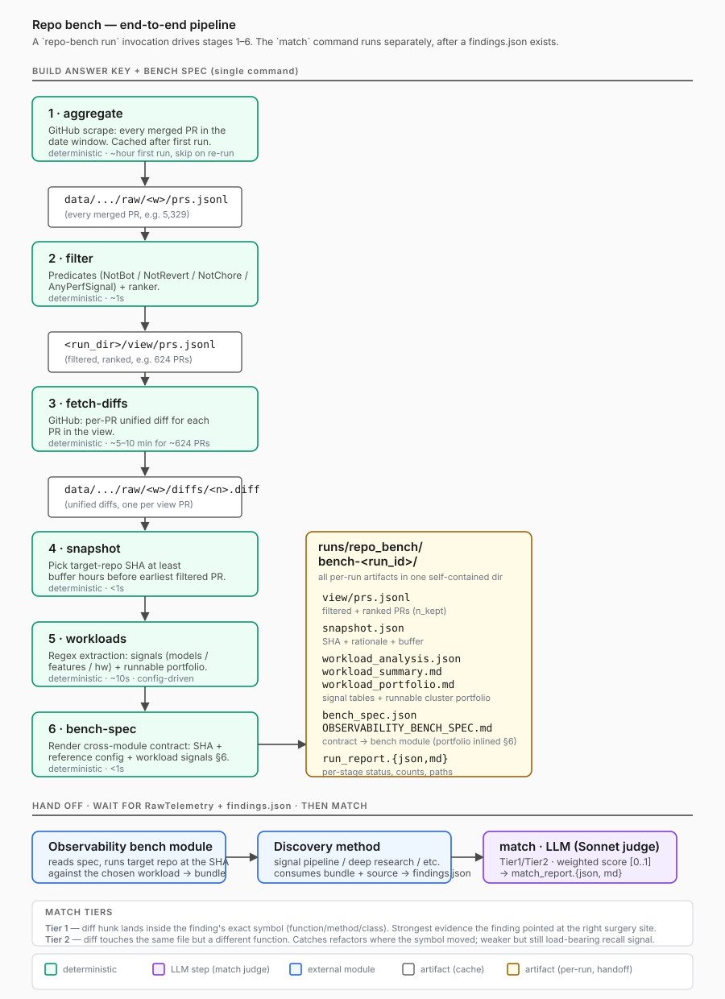

# Repo bench

> A self-contained Python module that builds a reproducible answer
> key from a target repo's merged PRs, then grades discovery output
> against it by direct match against the PRs' actual diffs.

The benchmark answers: **how much of the perf work that human authors
actually merged would a discovery method (signal pipeline, deep
research, source-only LLM, ...) rediscover from the same starting
point?**

## Pipeline at a glance



A single `repo-bench run` invocation drives stages 1–6 and
produces a self-contained run dir: filtered view + cached diffs +
snapshot SHA + workload signals + bench-spec ready for handoff to the
observability bench module.

The `match` step runs separately, after a discovery method has
produced a `findings.json` against the pinned SHA. It grades those
findings by judging each one against PR diffs in the filtered view.

### What each step does, in one line

| Step | In one line |
|---|---|
| **aggregate** | Pull every merged PR from the target repo's GitHub for the date window and cache them as JSONL. |
| **filter** | Apply rules over the raw PRs to drop bots / reverts / chores and keep only those with quantifiable perf signal; rank by `% × 1/files`. |
| **fetch-diffs** | Download the unified `git diff` for each PR in the filtered view. |
| **snapshot** | Pick a target-repo commit before the earliest filtered PR. The discovery pipeline must be blind to changes after this point. |
| **workloads** | Regex over filtered PRs to surface dominant model / feature / hardware / file-category signals. Output is a portfolio readers use to choose what workloads to run for telemetry capture. |
| **bench-spec** | Render the cross-module contract — SHA + reference config + workload signals + output naming — for the observability bench module. |
| **match** *(separate command)* | LLM judge compares each finding in a `findings.json` against PR diffs in the filtered view; produces strict / related / neighborhood / no_match verdicts per (finding, PR) pair plus per-finding hit rates. |

## Setup: Python environment

Requires Python 3.11+. From the repo root:

```bash
python3 -m venv .venv
source .venv/bin/activate
pip install -e .
```

The only runtime dependency is `pydantic>=2` — all other imports are
stdlib (`urllib` for HTTP, `argparse` for CLI, etc.).

## Setup: GitHub token

The pipeline scrapes PRs and downloads diffs from GitHub. You need a
personal access token (read-only `public_repo` scope is enough).

```powershell
$env:GITHUB_TOKEN = "ghp_..."   # PowerShell
```
```bash
export GITHUB_TOKEN=ghp_...     # bash
```

Either set `$GITHUB_TOKEN` once for the shell, or pass `--token` per
invocation. Without a token GitHub's anonymous rate limit (~60 req/h)
will throttle even a small window.

## Module surface

Four user-facing CLI commands:

| Command | What it does |
|---|---|
| **`aggregate`** | Scrape every merged PR for a date window into a JSONL cache. Run once per window; subsequent runs reuse the cache. |
| **`merge-windows`** | Merge multiple raw windows into one, deduplicating by `pr_number`. Useful for extending an existing window without re-fetching. |
| **`run`** | End-to-end: filter → fetch-diffs → snapshot → workloads → bench-spec. Builds the answer key + spec for the observability bench module. |
| **`match`** | Grade a `findings.json` against the filtered view by direct diff match. Run after a discovery method has produced findings. |

`filter`, `fetch-diffs`, and `snapshot` exist as standalone subcommands
for debugging / re-running individual steps, but `run` is the normal
entry point.

### Examples

```powershell
# 1) Scrape (one-time per window). Reuses cache after first run.
python -m spotlights_engine.repo_bench.cli aggregate 
  --start 2025-12-02 --end 2026-06-03

# 2) Filter + diffs + snapshot + workloads + bench-spec.
python -m spotlights_engine.repo_bench.cli run 
  --start 2025-12-02 --end 2026-06-03 
  --rules not-bot,not-revert,not-chore,any-perf-signal-or-label,rank-spec-mag

# 3) Extend an existing window with newer PRs (no re-fetch of old data).
python -m spotlights_engine.repo_bench.cli aggregate 
  --start 2026-06-03 --end 2026-06-10
python -m spotlights_engine.repo_bench.cli merge-windows 
  --windows 2025-12-02__2026-06-03 2026-06-03__2026-06-10

# 4) Grade findings against the filtered view (run separately, after
#    a discovery method has produced findings.json against the pinned SHA).
python -m spotlights_engine.repo_bench.cli match 
  --findings <findings.json> 
  --bench-run-dir runs/repo_bench/bench-<window>__<view>__<UTC>/ 
  --experiment <label>
```

`match` writes both `match_report.json` and `match_report.md` to
`<bench-run-dir>/matching/<experiment>/`. The MD has the headline
weighted score, per-finding verdicts, and citation per matched PR.

### Running as a background daemon (macOS)

The `aggregate` step can take several hours for large repos. To run it
in the background so it survives terminal close and macOS idle sleep:

```bash
caffeinate -i nohup python -m spotlights_engine.repo_bench.cli aggregate \
  --start 2025-12-02 --end 2026-06-03 > aggregate.log 2>&1 &
```

- `caffeinate -i` — prevents macOS idle sleep while the process runs
- `nohup ... &` — detaches from the terminal session
- `> aggregate.log 2>&1` — captures stdout/stderr to a log file

Monitor progress:

```bash
tail -f aggregate.log
```

Stop the process:

```bash
pkill -f "repo_bench.cli aggregate"
```

The scrape saves progress incrementally to
`data/repo_bench/raw/<window>/prs.jsonl.partial`, so restarting after
a crash resumes from the last fetched PR.

### Python API

```python
from spotlights_engine.repo_bench import aggregation, run, filtering, matching

# Merge two windows without re-fetching the older one.
merged = aggregation.merge_windows(
    window_ids=["2025-12-02__2026-06-03", "2026-06-03__2026-06-10"],
)
print(merged.window_id, merged.total_prs)  # 2025-12-02__2026-06-10, <combined count>

handle = run.benchmark(
    window_start="2025-12-02",
    window_end="2026-06-03",
    rules=[
        filtering.NotBot(),
        filtering.NotRevert(),
        filtering.NotChore(),
        filtering.AnyPerfSignalOrLabel(),
        filtering.RankBySpecificityAndMagnitude(),
    ],
)
print(handle.bench_spec_md)  # OBSERVABILITY_BENCH_SPEC.md path

m = matching.run_matching(
    findings_path=Path("path/to/findings.json"),
    bench_run_dir=handle.bench_spec_md.parent,
    experiment_id="my-experiment",
)
print(m.weighted_score, m.report_md_path)
```

## The six stages of `run`

| # | Stage | Role | Cost | Output |
|---|---|---|---|---|
| 1 | `aggregate` | Pull every merged PR in window from the target repo's GitHub | hour-ish first run; skip on re-run | `data/repo_bench/raw/<window>/prs.jsonl` |
| 2 | `filter` | Predicates + ranker over raw → ranked subset | <1s, deterministic | `<run_dir>/view/prs.jsonl` |
| 3 | `fetch-diffs` | Per-PR unified diffs from GitHub for the view | ~3 min for 200 PRs | `data/repo_bench/raw/<window>/diffs/<n>.diff` |
| 4 | `snapshot` | Deterministic: pick a target SHA ≥ buffer before earliest filtered PR | <1s | `<run_dir>/snapshot.json` |
| 5 | `workloads` | Regex extraction of signals + runnable command portfolio | <10s | `<run_dir>/{workload_analysis.json, workload_summary.md, workload_portfolio.md}` |
| 6 | `bench-spec` | Render the cross-module spec for the observability bench, with workload signals inlined | <1s | `<run_dir>/{bench_spec.json, OBSERVABILITY_BENCH_SPEC.md}` |

Every step's existing cache or skip-if-exists check decides whether
real work happens. A second invocation with identical inputs is a
no-op (zero LLM calls, all cache hits, byte-identical artifacts).

## The match command (separate step)

`match` grades a `findings.json` against the filtered view by direct
diff inspection. No curator-extracted answer key — the diffs *are* the
answer.

For each finding, the matcher:

1. Bucket candidate PRs by file overlap (PRs in the view whose diff
   touches the finding's file).
2. Sub-classify into **Tier 1** (diff hunk inside the finding's
   symbol) and **Tier 2** (same file, different function).
3. Slice each candidate's diff to only hunks in the finding's file
   (cuts noise from multi-file PRs).
4. One LLM call per finding: judge produces a verdict per candidate
   PR.

Verdicts:

| Verdict | Roll-up rule |
|---|---|
| `same_idea` | Diff makes essentially the same change as the finding |
| `related` | Diff touches the same code with a related but distinct change |
| `neighborhood` | Diff touches the same file but unrelated code |
| `no_match` | Diff has nothing to do with the finding |

Output: `match_report.json` + `match_report.md` with per-finding
verdicts, top-line hit rates (`strict_share`, `loose_share`),
`tier_2_yield` (findings that matched only at Tier 2 — captures
refactors where the finding's symbol moved to a sibling function),
and a single quality-weighted score:

| Verdict | T1 weight | T2 weight |
|---|---:|---:|
| `same_idea` | 1.00 | 0.70 |
| `related` | 0.60 | 0.40 |
| `neighborhood` | 0.05 | 0.05 |
| `no_match` | 0.00 | 0.00 |

Per-finding score = best (verdict, tier) weight across its matches.
`weighted_score` = mean across findings, in `[0, 1]`. T1 vs T2
weight gap captures that hitting the *exact function* the finding
named is stronger evidence than just hitting the same file.

## Snapshot SHA — what it pins, why a buffer

The discovery pipeline operates on target-repo source at some commit.
The benchmark scores discovery against PRs that landed *after* that
commit, so they're real recall targets, not changes already merged
into the codebase.

The snapshot picker:

1. Loads the filtered view's PR numbers; joins against raw to get
   `merged_at`.
2. Finds the **earliest** `merged_at` across them.
3. Computes a cutoff = earliest − `buffer_hours` (default 24h,
   override via `--snapshot-buffer-hours`).
4. Picks the latest raw PR merged before that cutoff.
5. Pins its `merge_sha`. Every filtered PR is now ≥ buffer hours
   newer than the snapshot.

The buffer guards against the target merging two related PRs in
rapid succession; without it, the snapshot's parent could already
contain side effects of changes we're about to score against.

## Run-dir layout

Every `repo-bench run` invocation produces one
self-contained run directory under `runs/repo_bench/`:

```
runs/repo_bench/bench-<window>__<view>__<UTC>/
  view/
    prs.jsonl                    # filtered + ranked PRs
    manifest.json                # rule specs, counts, derived_at
  snapshot.json                  # SHA pin + rationale
  workload_analysis.json         # full per-PR signals + clusters
  workload_summary.md            # aggregate signal tables (top models / features / ...)
  workload_portfolio.md          # runnable portfolio (inlined into bench-spec §6)
  bench_spec.json                # canonical cross-module contract
  OBSERVABILITY_BENCH_SPEC.md    # rendered spec, includes workload signals §6
  run_report.json                # per-stage status, counts, paths
  run_report.md                  # human-readable summary
  matching/                      # populated when `match` runs
    <experiment>/
      match_report.json
```

Cached input (raw scrape) lives separately under
`data/repo_bench/raw/<window>/` — distinct lifecycle. The
`bench-` prefix on the run-id makes the directory self-identifying.

The raw scrape (`prs.jsonl`) and per-PR diffs are gitignored — both
are GitHub-rebuildable via `aggregate` / `fetch-diffs`. Each fresh
clone of the repo re-fetches.

## Schemas (the contract)

| Type | What it is | Lives in |
|---|---|---|
| `RawPR` | One scraped PR; the input to filtering | `schemas.py` |
| `RuleSpec` | Filter rule's identity (name, version, kind, params) — drives `view_id` | `schemas.py` |
| `SnapshotPin` | The target-repo SHA + rationale + buffer + n_view | `schemas.py` |
| `BenchSpec` | The cross-module contract handed to the observability bench | `schemas.py` |
| `RunReport` | Per-run summary | `schemas.py` |
| `MatchOutput` | Match agent's per-finding verdicts | `matching.py` |

Hash fields are constrained to lowercase 64-char hex.
`SnapshotPin.snapshot_sha` is a 40-char hex pattern.

## Filter rules

| Rule | Effect |
|---|---|
| `NotBot` | Drop PRs whose author looks like a bot (dependabot, github-actions, `*-bot`, etc.) |
| `NotRevert` | Drop PRs whose title starts with `Revert` / `[Revert ...]` |
| `NotChore` | Drop PRs tagged as bugfix / CI / test / doc / refactor / chore — UNLESS body has a strict perf claim |
| `TitleStrictPerfClaim` | Keep PRs whose title carries a number bound to a perf noun (e.g. `5% throughput improvement`, `3x speedup`) |
| `BodyStrictPerfClaim` | Same regex over the body |
| `AnyStrictPerfClaim` | Title OR body |
| `AnyLoosePerfClaim` | Same shape, more tolerant of phrasing distance |
| `AnyPerfSignal` | Strict claim (title or body) OR `[Perf]` / `[Performance]` / `[Optimize]` author tag |
| `AnyPerfSignalOrLabel` | `AnyPerfSignal` plus a labels-carry-perf-signal recall path: keep if any label is in the active config's `perf_labels` whitelist (e.g. `performance`, `kv-connector` for vllm). Recovers staged feature work that doesn't quantify per-PR. |
| `RankBySpecificityAndMagnitude` | Score = `claimed_pct × 1/files_changed`. Single ranker per view. |

The `view_id` is a 12-char hex hash of the canonical (sorted) rule
specs. Two rule lists with the same `view_id` produce the same
filtered view.

## Workload signals

The workloads stage reads filtered PRs' titles + bodies + diffs and
extracts two views of the same data:

**1. Aggregate signal tables** (`workload_summary.md`):
- Models (regex over configured model families)
- Features (e.g. FP8, MoE, expert-parallel, spec-decode, prefix-cache)
- Hardware (Hopper, Blackwell, AMD, etc.)
- File categories touched
- Parallelism axes (tp, pp, dp, max_num_seqs)

**2. Runnable workload portfolio** (`workload_portfolio.md`,
inlined into `OBSERVABILITY_BENCH_SPEC.md` as §6):
- Multi-line `serve_command` + `bench_command` blocks extracted
  verbatim from PR bodies (with `\<newline>` continuations resolved
  and `$MODEL` shell-vars substituted)
- Clustered by (model family, feature flags); top-N by PR coverage
- Hardware tag picked from prose near the command

Both views are regex-only — no LLM calls. An opt-in
`--workload-llm` flag swaps in an LLM-based extractor for the
runnable portfolio when regex isn't enough; default-off because
regex covers the common case for ~$0.

## Config

All repo-specific patterns (model families, feature flags, hardware
tags, file→category mappings, perf nouns, chore tags) live in TOML
configs under
[`src/spotlights_engine/repo_bench/configs/`](../../src/spotlights_engine/repo_bench/configs/):

```
configs/
  vllm.toml          # ships in repo, the default
  <your-repo>.toml   # add for any new target
```

Pass `--config <name-or-path>` to the CLI:

```
repo-bench run --config vllm ...                 # default
repo-bench run --config /path/to/postgres.toml ...
```

Each TOML file extends a generic baseline (perf nouns like
`throughput`, `latency`, `improvement`; chore tags like `bugfix`,
`fix`, `ci`, `doc`). Repo-specific entries add to the baseline; you
don't redeclare what's already generic.

The schema is in
[`src/spotlights_engine/repo_bench/config.py`](../../src/spotlights_engine/repo_bench/config.py).

## Costs, roughly

The bench module itself does **zero** LLM calls during `run`. The
workload signals are regex; the snapshot is deterministic; the
bench-spec is template rendering. End-to-end `run` cost is GitHub
API (free with token) + ~5 min wallclock for ~200 diffs.

The match step is the only LLM cost on the repo-bench side:

| Call | Model | Input | Output | Per-call |
|---|---|---|---|---|
| Match (per finding) | Sonnet | ~5–50 KB (file-filtered diff slices for candidates) | ~1 KB | ~$0.05–0.20 |

For a 148-finding run against a 200-PR view, total match cost is
typically ~$1–5 (judge calls only fire when a finding has at least
one file-overlap candidate).

## Reproducibility, honestly

- **Cache replay is deterministic.** Re-running `run` with no input
  changes is a no-op: filter regenerates from cached raw, snapshot
  regenerates from cached raw + view, workload signals regenerate
  from cached diffs. Byte-identical output.
- **Match cache populates fresh per run.** Each `match` invocation
  judges the findings against current diffs. Matching is not yet
  cached (POC stance — prompt + judge model are stable across runs,
  but no on-disk cache).
- **`prompt_sha256` and `model_id` land in the manifest** so any
  future review can verify what produced the report.

## Contract with adjacent modules

```
                ┌──────────────────────────┐
                │ Repo bench      │
                │ (this module)            │
                │                          │
                │  produces:               │
                │  - filtered view +       │
                │    snapshot SHA          │
                │  - OBSERVABILITY_BENCH_  │
                │     SPEC.md   ───┐       │
                └──────────────────┼───────┘
                                   │
                                   ▼
            ┌──────────────────────────────────┐
            │ Observability bench module       │
            │                                  │
            │  reads spec, runs target repo at │
            │  pinned SHA against the workload │
            │  signals, produces:              │
            │  data/<timestamp>_<config>_      │
            │    repo-<short_sha>/             │
            └──────────┬───────────────────────┘
                       │
                       ▼
            ┌──────────────────────────────────┐
            │ Discovery method                 │
            │ (signal pipeline / deep research │
            │  / source-only LLM / ...)        │
            │                                  │
            │  reads RawTelemetry + source     │
            │  at the SHA, produces:           │
            │  findings.json                   │
            └──────────┬───────────────────────┘
                       │
                       ▼ (back into this module)
   repo-bench match → matching/<experiment>/match_report.json
```

The bench spec we hand to the observability bench module is the only
load-bearing communication outward. Everything else is one-way.

## Module layout

```
src/spotlights_engine/repo_bench/
  __init__.py
  cli.py                     # 6 subcommands: aggregate, merge-windows,
                             #   filter, fetch-diffs, run, match
  schemas.py                 # all pydantic models
  storage.py                 # path resolution, atomic writes
  aggregation.py             # GitHub scrape
  diff_fetcher.py            # per-PR unified diffs
  snapshot.py                # SHA picker (deterministic)
  workloads.py               # workload signal extraction
  bench_spec.py              # JSON + MD render for the spec
  matching.py                # findings → diffs LLM judge
  report.py                  # JSON + MD render for run summaries
  run.py                     # orchestrator (run.benchmark)
  templates/                 # MD templates (bench_spec, run_report)

  filtering/
    __init__.py
    heuristics.py            # bot/revert/perf-claim/perf-tag regex
    rules.py                 # all filter rules + RankBySpecificityAndMagnitude
    derive.py                # apply rules → <run_dir>/view/

tests/unit/repo_bench/
  test_aggregation.py        # GitHub scrape (no network in CI)
  test_filtering.py          # rules + derive + view_id determinism
  test_diff_fetcher.py       # diff fetcher with stub HTTP
  test_bench_spec.py         # spec JSON + MD render
  test_report.py             # run report JSON + MD render
  test_storage.py            # IO primitives
```

78 tests; the full suite runs in ~1 second. No live LLM calls in
tests — `match` accepts an injected runner protocol.

## Companion docs

- [`PROGRESS_UI_BRIEF.md`](PROGRESS_UI_BRIEF.md) — historical brief
  for adding a live multi-stage progress UI to `repo-bench
  run`.
