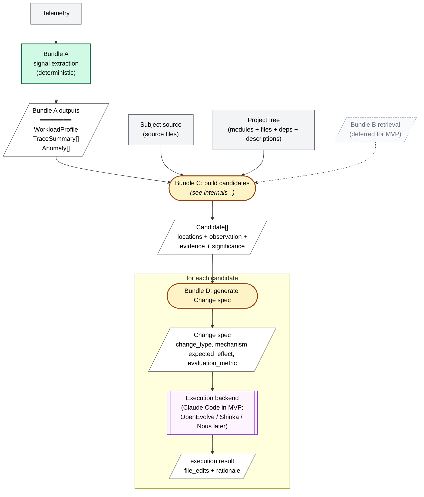
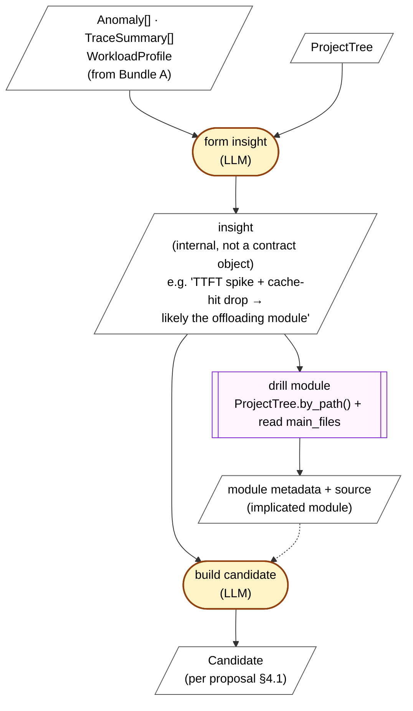

# Signal-Based Discovery — MVP Flow

Aligned with `proposal/discovery_engine_proposal.md`, `contracts/signal_interface_spec.md`, and `plans/bundle_charters.md`. Bundle labels in this file are pointers — `bundle_charters.md` is the source of truth on what each bundle owns.

Concrete public APIs (function signatures, schemas, interaction walks) live in `contracts/mvp_module_apis.md`. This file is the visual + narrative; the API doc is the implementation contract.

**Scope note.** This is the MVP one-shot pipeline: telemetry in, candidates and changes out. The closed-loop view — live telemetry feeding validation, archive informing future signals/candidates/validation — is described in `proposal/discovery_engine_proposal.md` §4.2 and is intentionally out of scope here. Loops will be added to a separate diagram once the feedback architecture is designed.

## How it runs

```python
def signal_discovery(telemetry, subject_root, bundle_a, projecttree_api):
    # Pseudocode mirrors the public API in contracts/mvp_module_apis.md.
    # If anything diverges, that doc is the source of truth.

    # ── Bundle A: deterministic signal extraction (no LLM)
    workload, traces, anomalies = bundle_a.process(telemetry)
    # → WorkloadProfile, list[TraceSummary], list[Anomaly]
    # See contracts/signal_interface_spec.md for the locked schemas.

    # ── ProjectTree: structural map of the subject system (no LLM)
    project_tree = modules_extractor.extract(subject_root)

    # ── Bundle C: reasons over signals + structure → Candidate[]
    # Internally runs ≥2 LLM stages (form insight, build candidate) and
    # may drill modules / pull raw traces on demand via the injected clients.
    candidates = bundle_c.build_candidates(
        workload, traces, anomalies, project_tree,
        bundle_a=bundle_a,                 # for get_raw_trace
        project_tree_api=projecttree_api,  # for by-path drills
        subject_root=subject_root,         # for reading source files
        # knowledge=bundle_b.query        # technique-driven; deferred for MVP
    )

    # ── Bundle D: per-candidate Change spec + execution handoff
    results = []
    for c in candidates:
        change = bundle_d.generate_change(c)                       # LLM → Change spec
        result = bundle_d.handoff(change, backend_id="claude_code")  # → ExecutionResult
        results.append((change, result))

    # Bundle E (validation) + Bundle F (archive) close the loop.
    # See proposal §4.3 stages 4–5. Out of scope for this flow doc.
    return results
```

LLM-call counts (for cost/latency planning):

- **Bundle C**: ~2 LLM calls per run (form insight, build candidate), plus any on-demand drill prompts the implementation chooses to make.
- **Bundle D**: 1 LLM call per candidate (`generate_change`).
- **Execution backend**: 1 invocation per candidate (Claude Code in MVP — itself an agent that may make many internal calls).

## How it connects



Not drawn in the diagram: `get_raw_trace(pointer)` is a side channel from Bundle C back to Bundle A, used on demand when `TraceSummary` isn't enough. It's in the locked Signal interface but not shown here because it's optional and would dominate the picture.

## Bundle C internals (proposed)

The contract specifies Bundle C's external interface (signals in, `Candidate[]` out) but not its internal reasoning structure. The proposed structure runs in three stages: form an initial insight from signals + tree, optionally drill into the implicated source module, then build the structured `Candidate`.



Notes:
- *Insight* is an internal artifact, not a contract object — its shape is Bundle C's owner's call.
- The code-drill step is what `get_raw_trace` is for telemetry, but there is no analogous API for source. See Open Question 2.

## Visual vocabulary

- **Green rectangle** — Bundle A: deterministic signal extraction. No LLM.
- **Yellow rounded** — pure LLM prompt (Bundle C, Bundle D). Inputs in, structured output out.
- **Purple subroutine** — execution backend. Claude Code in MVP; other backends per Bundle D charter.
- **White parallelogram** — data artifact. Schema lives inside the node.
- **Gray rectangle** — external input.
- **Dashed gray box** — deferred for MVP (Bundle B retrieval; Bundle E / F closure not drawn).

## Demo stories — two findings, same workload

The same agentic-workload telemetry can produce more than one finding. Two examples below run through the same pipeline; they differ in which `Anomaly` types fire and how Bundle C reasons over them.

### Finding I — transfer-latency / prefetch (proposal §4.3)

| Stage | Object |
|---|---|
| Anomaly (Bundle A) | `type=stall, components=[gpu], magnitude="GPU idle 12% of decode time", description="memcpy-correlated stalls"` |
| Candidate (Bundle C) | `locations=[KV cache manager, scheduler]; observation="GPU stalls waiting for KV blocks fetched from CPU during decode"; evidence=traces; significance="bounds throughput on agentic workloads"` |
| Change (Bundle D) | `change_type=prefetch; mechanism="during prefill bubbles, prefetch KV blocks predicted for decode"; evaluation_metric="end-to-end latency + correctness regression"` |

### Finding II — eviction policy / ARC

| Stage | Object |
|---|---|
| Anomaly (Bundle A) | `type=anomalous_distribution, components=[kv_cache_manager], magnitude="hit-rate −22% on agentic vs single-turn baseline", description="reused contexts evicted under load; eviction pattern mismatched to reuse pattern"` |
| Candidate (Bundle C) | `locations=[KV cache manager, eviction policy]; observation="LRU evicts contexts with high upcoming reuse on agentic workloads"; evidence="hit-rate vs reuse-pattern correlation"; significance="affects agentic workload class specifically"` |
| Change (Bundle D) | `change_type=replace; mechanism="swap LRU for ARC or workload-aware policy"; evaluation_metric="hit-rate + end-to-end latency"` |

The two findings are independent; the pipeline can produce either, both, or neither, depending on which `Anomaly` types Bundle A's heuristics emit and how Bundle C ranks them.

## Open questions

1. **Candidate granularity** — function / abstraction / behavior. Affects Bundle D's Change-generation prompt. Not pinned by the proposal.
2. **Code-access contract** — Bundle C reads the subject system's source directly, receives a structural view (ProjectTree), and drills into specific modules on demand. Status:
    - (a) **Who produces the structural view** — *answered.* `spotlights-engine`'s `modules_extractor` produces a `ProjectTree`, available as a Python library (`from spotlights_engine.modules_extractor import extract`) or HTTP API (`GET /v1/projecttrees/{map_id}/...`). Schema and API spec live in `spotlights-engine/docs/projecttree/agent_projecttree_guide.md`.
    - (b) **Commit pinning** — *open.* ProjectTree's schema doesn't carry a commit ref; `WorkloadProfile.software_version` captures the runtime commit; nothing currently requires the two to match.
    - (c) **`get_source(module)` API** — *partially answered.* ProjectTree exposes `GET /v1/projecttrees/{map_id}/modules/by-path?path=...` (returns module metadata: description, depends_on, main_files w/ roles, submodules) and `POST /v1/projecttrees/{map_id}/explain-module` (reviewer-style summary). For raw source bytes, Bundle C reads files at `subject_root / module.path / file.path` — `file.path` is **module-relative**, not repo-relative (see `contracts/mvp_module_apis.md`). No contracted file-read API exists.
3. **Bundle B wiring** — technique-driven discovery (proposal §4.4) and literature retrieval are deferred for MVP. When does Bundle B's `query()` enter Bundle C's prompt?
