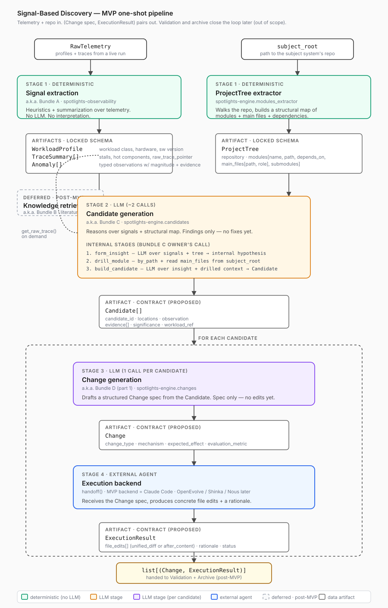

# Signal-Based Discovery — human overview

A 5-minute read. The detailed companions in this folder are agent-friendly references; this file is for someone who wants to understand the pipeline before opening the code.

- **Flow doc** (deep, with mermaid + demo stories): [signal_discovery_flow.md](signal_discovery_flow.md)
- **API contract** (signatures + schemas): [mvp_module_apis.md](mvp_module_apis.md)
- **Alignment notes** (decisions, open Qs): [signal_discovery_flow_alignment.md](signal_discovery_flow_alignment.md)

---

## In one sentence

Take a live workload's telemetry and the subject system's repo, and produce a list of concrete, evidence-backed code changes — each with a rationale and an applied diff.

## What goes in, what comes out

| | |
|---|---|
| **Input** | `RawTelemetry` (profiles + traces from a live run) + `subject_root` (path to the subject system's repo) |
| **Output** | `list[(Change, ExecutionResult)]` — for each finding: a structured Change spec and the concrete file edits a coding agent applied for it |

That's the MVP. Validation (does the change actually help?) and archive (remember what worked) are explicitly **not** in this pipeline yet.

## The flow at a glance



Read top-to-bottom:

1. **Signal extraction** *(deterministic, no LLM)* — turns raw telemetry into three structured artifacts: a workload profile, summarized traces, and typed anomalies.
2. **ProjectTree extractor** *(deterministic, no LLM)* — walks the repo and produces a structural map: modules, their main files, dependencies, descriptions.
3. **Candidate generation** *(~2 LLM calls per run)* — reasons over the signals + the structural map to find what's worth fixing. **Findings only** — it does not propose fixes. Internally: form an insight, drill the implicated module to read its source, then build a structured `Candidate`.
4. **Change generation** *(1 LLM call per candidate)* — turns each `Candidate` into a `Change` spec: change type, mechanism, expected effect, how to evaluate.
5. **Execution backend** *(external coding agent — Claude Code in MVP)* — takes the Change spec and produces an `ExecutionResult` with concrete file edits + a rationale.

Knowledge retrieval (literature/web survey) is sketched but **deferred** for MVP. So is the closed loop (validation feeding back into future runs).

## Each stage's I/O at a glance

| Stage | What it is | Takes | Returns |
|---|---|---|---|
| Signal extraction *(Bundle A)* | deterministic | `RawTelemetry` | `WorkloadProfile`, `TraceSummary[]`, `Anomaly[]` |
| ProjectTree extractor | deterministic | `subject_root` (path) | `ProjectTree` |
| Candidate generation *(Bundle C)* | LLM | signals + `ProjectTree` + live drill clients | `Candidate[]` |
| Change generation *(Bundle D, part 1)* | LLM | `Candidate` | `Change` spec |
| Execution backend | external agent | `Change` spec | `ExecutionResult` (file edits + rationale) |

Schemas live in [mvp_module_apis.md](mvp_module_apis.md). The Signal-extraction schemas are **locked** by `contracts/signal_interface_spec.md`; ProjectTree is locked by [docs/projecttree/](../projecttree/); the rest are **proposed** and need bundle-owner signoff.

## Reading the diagram

- **Green** boxes are deterministic stages (no LLM).
- **Yellow / purple** boxes are LLM stages — yellow is the once-per-run candidate generation, purple is the per-candidate change generation.
- **Blue** is the external coding agent that actually edits the code.
- **Dashed grey** is deferred for MVP (knowledge retrieval).
- **White** rectangles are data artifacts; the line under each artifact's name is its key fields.
- The dashed loop frame around stages 3–4 means "for each candidate."
- The dashed back-arrow on the left is `get_raw_trace()` — Candidate generation can pull a raw capture from Signal extraction on demand when a `TraceSummary` isn't enough.

## How it actually runs (pseudocode)

```python
def signal_discovery(telemetry, subject_root):
    workload, traces, anomalies = signal_extraction.process(telemetry)
    project_tree = modules_extractor.extract(subject_root)

    candidates = candidate_generation.build_candidates(
        workload, traces, anomalies, project_tree,
        bundle_a=signal_extraction,        # for get_raw_trace
        project_tree_api=projecttree_api,  # for by-path drills
        subject_root=subject_root,         # for reading source files
    )

    results = []
    for c in candidates:
        change = change_generation.generate_change(c)
        result = change_generation.handoff(change, backend_id="claude_code")
        results.append((change, result))
    return results
```

LLM-call budget: **~2 calls** for the whole candidate-generation pass + **1 call per candidate** for change generation + **1 backend invocation per candidate** (Claude Code is itself an agent that may make many internal calls).

## What's deferred (so you know it's not missing — it's later)

- **Knowledge retrieval** *(Bundle B)*: literature / web survey wired into Candidate generation. Charter exists; not on the MVP critical path.
- **Validation** *(Bundle E)*: does the applied change actually move the metric? Closes the loop.
- **Archive** *(Bundle F)*: persist findings + outcomes so future runs can learn from them.

These are the missing pieces between "we made an edit" and "the system gets better over time." See `proposal/discovery_engine_proposal.md` §4.2 for the closed-loop view.

## If you want to dig deeper

- **Want the full mermaid flow + demo stories** (e.g. KV-prefetch finding vs eviction-policy finding) → [signal_discovery_flow.md](signal_discovery_flow.md)
- **Want the exact function signatures and schemas** → [mvp_module_apis.md](mvp_module_apis.md)
- **Want the rationale for why each contract looks the way it does** → [signal_discovery_flow_alignment.md](signal_discovery_flow_alignment.md)
- **Want the bundle charters (who owns what)** → `discovery-docs/plans/bundle_charters.md`
