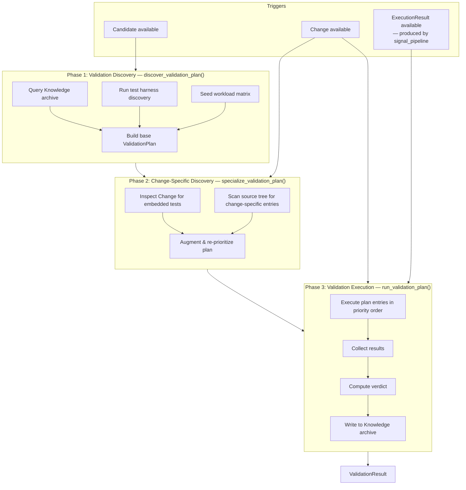
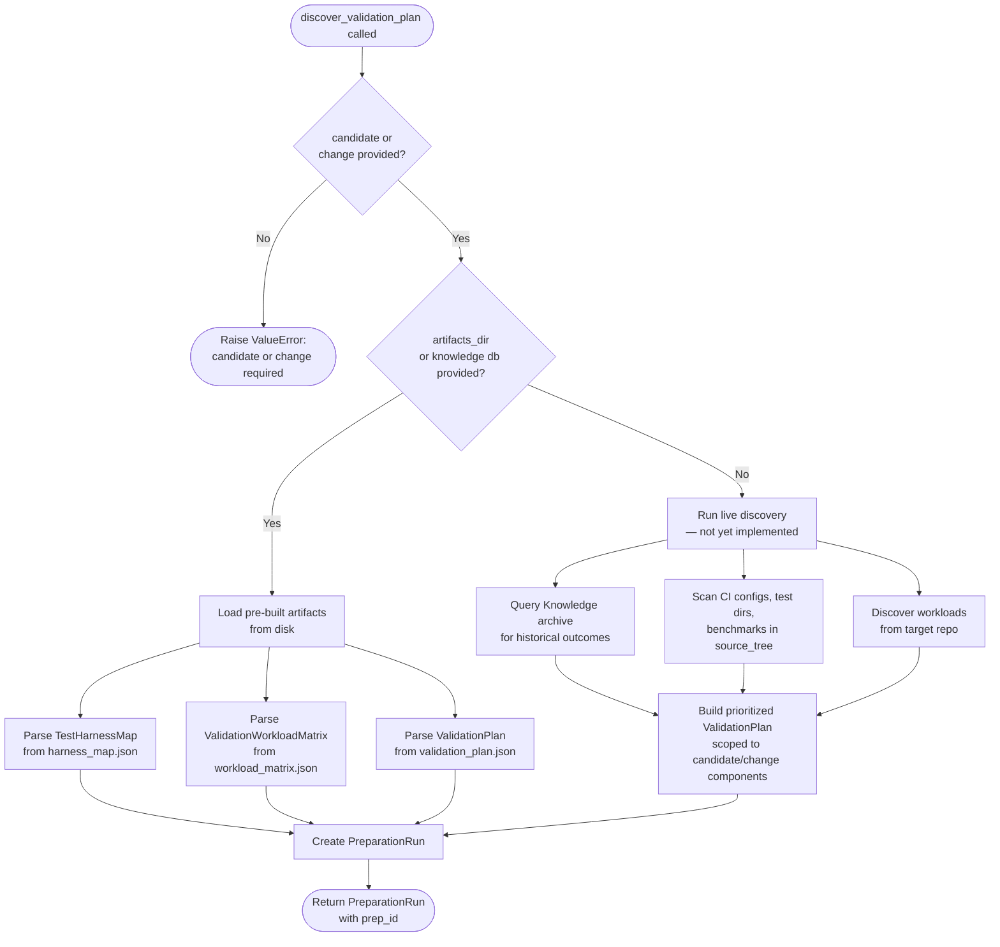
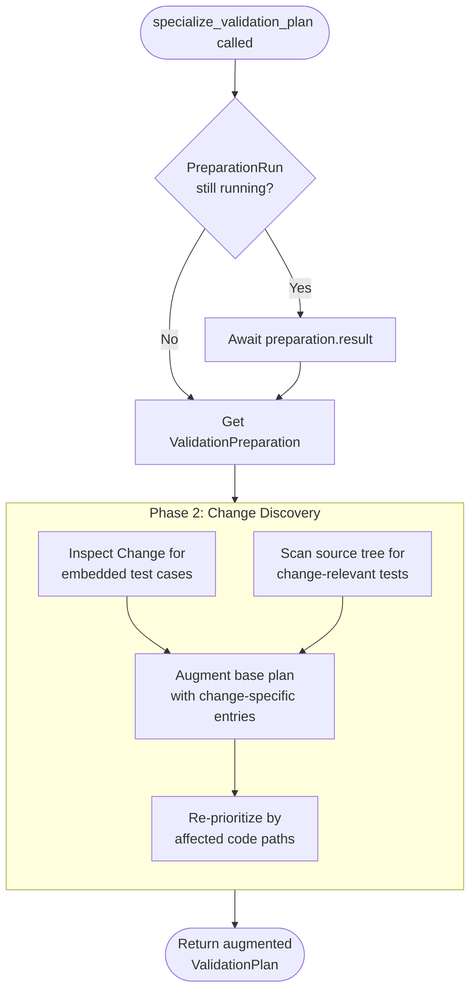
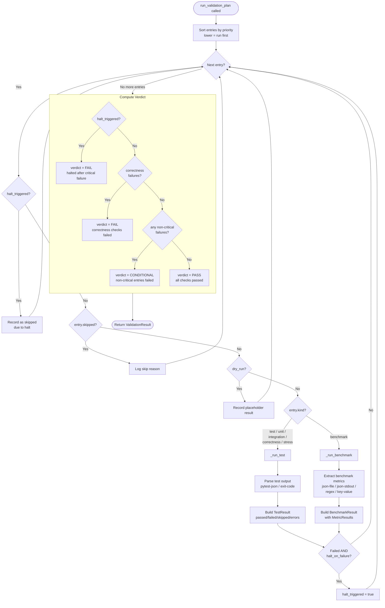
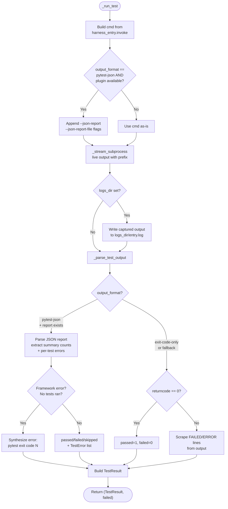
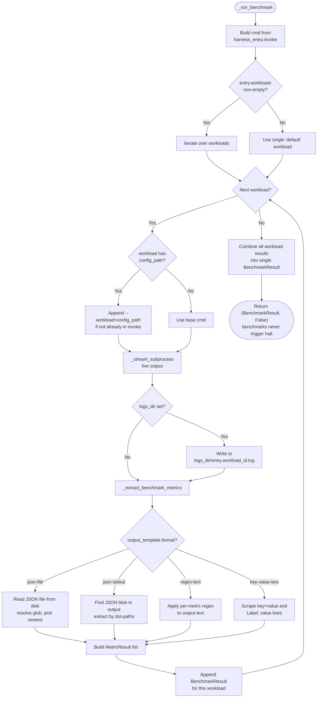
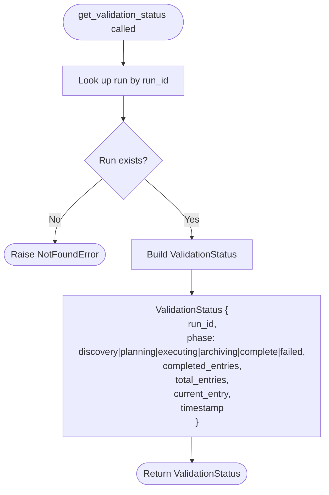
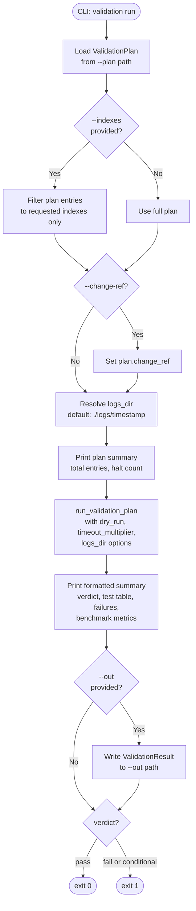

# Validation Phase Flow Charts

## Overview: Full Validation Pipeline

---

## API: `discover_validation_plan(source_tree, artifacts_dir | knowledge db, candidate?, change?)`

---

## API: `specialize_validation_plan(change, execution_result, preparation)`

---

## API: `run_validation_plan(plan, source_tree, ...)`

This is the core execution engine (Phase 3 implementation).

---

## API: `_run_test(entry, source_tree, timeout, logs_dir)`

---

## API: `_run_benchmark(entry, source_tree, timeout, logs_dir)`

---

## API: `get_validation_status(run_id)`

---

## CLI: `validation run` Command

